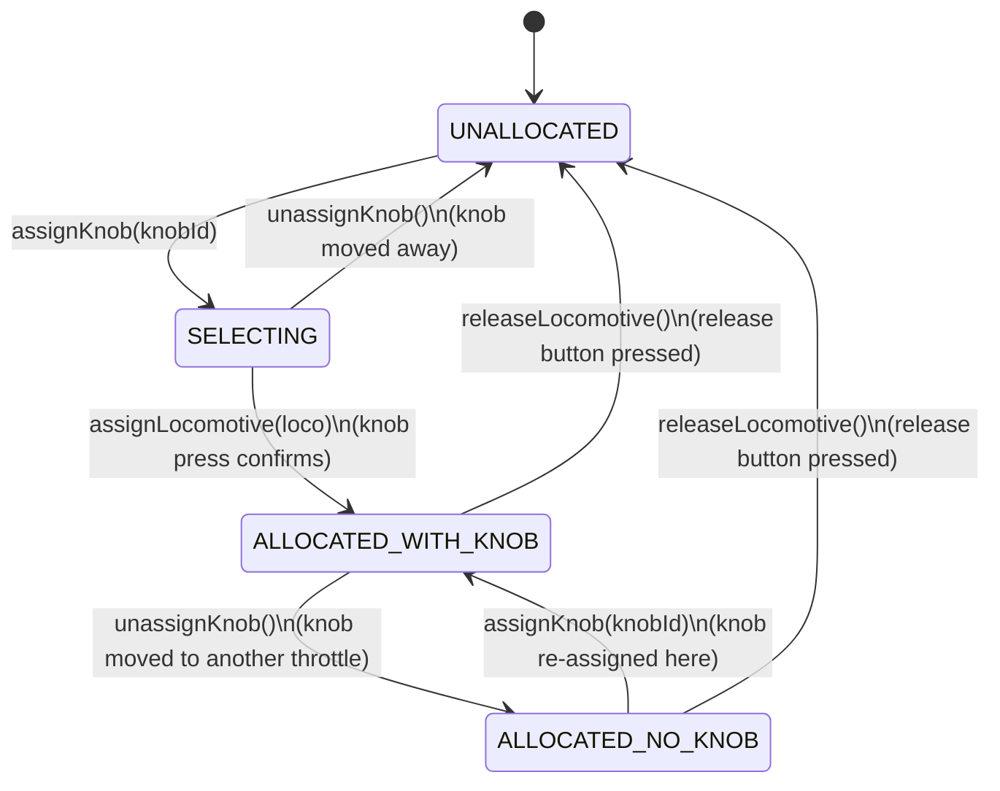
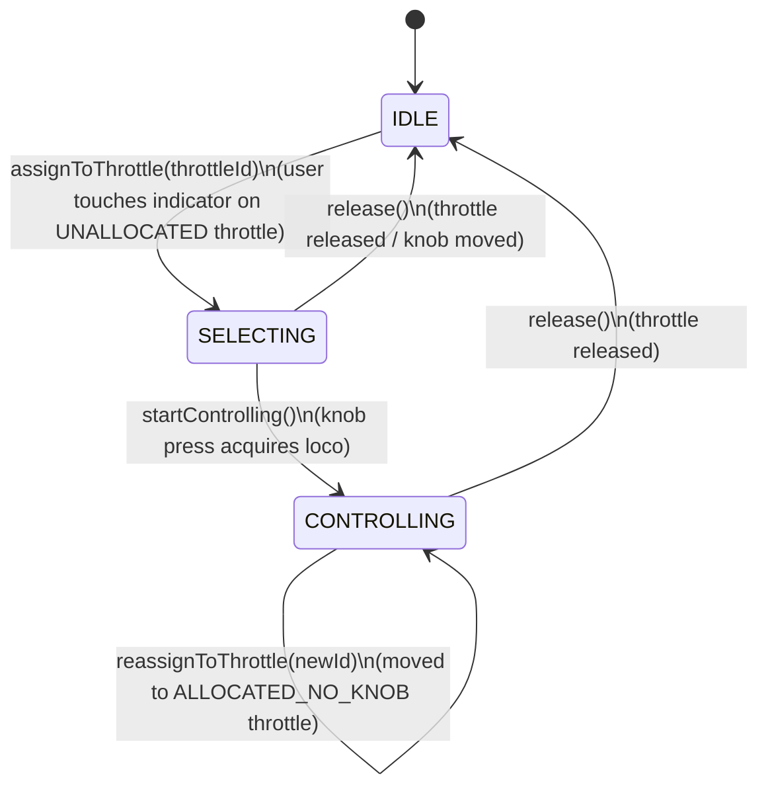
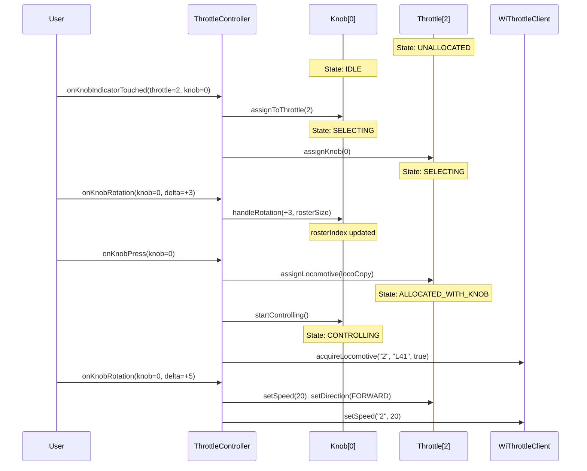
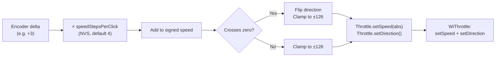

# State Machines

## Overview

Two state machines drive the core interaction model: **Throttle** (allocation lifecycle) and **Knob** (encoder mode). They are tightly coupled — knob transitions often trigger throttle transitions and vice versa.

---

## Throttle State Machine

Each of the 4 throttles independently tracks its allocation state.

### States

| State | Knob | Loco | User can... |
|-------|------|------|-------------|
| `UNALLOCATED` | None | None | Touch knob indicator to start selection |
| `SELECTING` | Assigned | None | Rotate to browse roster, press to acquire |
| `ALLOCATED_WITH_KNOB` | Assigned | Assigned | Rotate to control speed, press for e-stop |
| `ALLOCATED_NO_KNOB` | None | Assigned | Touch knob indicator to re-assign, press release button |

### Transition Details

| From | To | Trigger | Side Effects |
|------|----|---------|--------------|
| `UNALLOCATED` | `SELECTING` | `assignKnob(knobId)` | Knob → SELECTING, roster carousel shown |
| `SELECTING` | `UNALLOCATED` | `unassignKnob()` | Knob released, roster carousel hidden |
| `SELECTING` | `ALLOCATED_WITH_KNOB` | `assignLocomotive(loco)` | WiThrottle acquire sent, knob → CONTROLLING |
| `ALLOCATED_WITH_KNOB` | `ALLOCATED_NO_KNOB` | `unassignKnob()` | Knob freed for another throttle |
| `ALLOCATED_WITH_KNOB` | `UNALLOCATED` | `releaseLocomotive()` | WiThrottle release sent, knob → IDLE |
| `ALLOCATED_NO_KNOB` | `ALLOCATED_WITH_KNOB` | `assignKnob(knobId)` | Knob → CONTROLLING (no roster phase) |
| `ALLOCATED_NO_KNOB` | `UNALLOCATED` | `releaseLocomotive()` | WiThrottle release sent |

---

## Knob State Machine

Each of the 2 knobs independently tracks its current mode.

### States

| State | Rotation does... | Press does... |
|-------|------------------|---------------|
| `IDLE` | Nothing | Nothing |
| `SELECTING` | Scrolls roster (wrapping) | Acquires displayed loco |
| `CONTROLLING` | Changes speed (±speedStepsPerClick) | Emergency stop |

### Interaction Between the Two Machines

---

## Speed Control Model

Speed is modelled as a **signed value** internally (-126 to +126), where:
- Positive = forward, negative = reverse
- Crossing zero automatically flips direction
- Clockwise rotation always increases, counter-clockwise decreases

