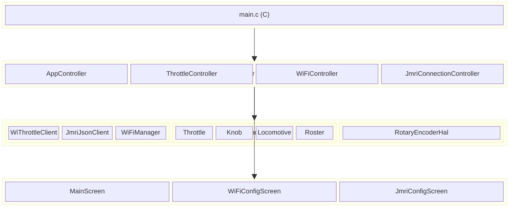
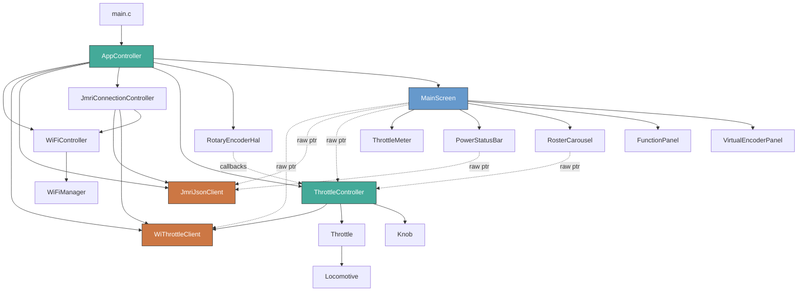
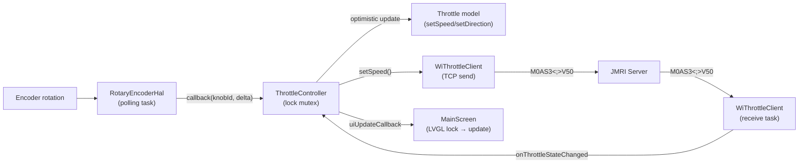

# System Overview

## Summary

ESP Layout Controller is an ESP32-S3 firmware providing a 7" touchscreen interface for model railway control. It manages 4 simultaneous locomotive throttles via the WiThrottle protocol, with 2 I2C rotary encoders for physical speed/selection control.

**Hardware:** ESP32-S3 (dual-core, 8 MB flash), 800×480 RGB LCD (ST7701), GT911 capacitive touch, 2× Adafruit I2C Seesaw rotary encoders (0x76, 0x77 via LTC4316 address translator).

**Protocols:** WiThrottle (TCP, throttle control + roster), JMRI JSON (WebSocket, track power), MQTT (future, cab signals).

---

## Layered Architecture



### Key Principle

**State lives at the application layer, not in the UI.** The UI holds raw pointers to controllers and can be destroyed/recreated freely (e.g. navigating to settings and back) without losing throttle assignments, speeds, or connection state.

```
Application Layer (survives screen changes)
  └─ ThrottleController (singleton)
       ├─ Throttle[4] → Locomotive (unique_ptr)
       └─ Knob[2]

UI Layer (disposable)
  └─ MainScreen → ThrottleController*  (raw pointer, not owned)
```

---

## Dependency Graph



**Legend:** Green = controllers (own state), Blue = UI (presentation), Red = communication (network I/O).

Solid arrows = ownership (`unique_ptr` or direct member). Dashed arrows = borrowed reference (raw pointer, not owned).

---

## Data Flow: Speed Change (End-to-End)



---

## File Organisation

```
main/
├── main.c                          # C entry point (hardware init only)
├── lvgl_port.c/h                   # LVGL display driver, mutex
├── waveshare_rgb_lcd_port.c/h      # LCD hardware driver
├── Kconfig.projbuild               # Build configuration (display, tests)
├── hardware/
│   └── RotaryEncoderHal.cpp/h      # I2C Seesaw encoder HAL
├── communication/
│   ├── WiFiManager.cpp/h           # WiFi STA + NVS credentials
│   ├── WiThrottleClient.cpp/h      # WiThrottle TCP protocol
│   └── JmriJsonClient.cpp/h        # JMRI JSON WebSocket
├── model/
│   ├── Locomotive.cpp/h            # Loco data (address, speed, functions)
│   ├── Throttle.cpp/h              # Throttle state machine + loco ownership
│   ├── Knob.cpp/h                  # Encoder knob state machine
│   └── Roster.cpp/h                # Available locos collection
├── controller/
│   ├── AppController.cpp/h         # Singleton, owns all services
│   ├── ThrottleController.cpp/h    # 4 throttles + 2 knobs coordinator
│   ├── WiFiController.cpp/h        # WiFi lifecycle
│   └── JmriConnectionController.cpp/h  # JMRI auto-connect + reconnect
├── ui/
│   ├── MainScreen.cpp/h            # Main 2×2 throttle grid + panels
│   ├── WiFiConfigScreen.cpp/h      # WiFi settings
│   ├── JmriConfigScreen.cpp/h      # JMRI connection + system status
│   ├── components/
│   │   ├── ThrottleMeter.cpp/h     # Circular gauge widget
│   │   ├── VirtualEncoderPanel.cpp/h  # On-screen encoder buttons (test)
│   │   ├── RosterCarousel.cpp/h    # Loco selection display
│   │   ├── FunctionPanel.cpp/h     # F0–F28 toggle buttons
│   │   └── PowerStatusBar.cpp/h    # Track power + connection status
│   └── wrappers/                   # extern "C" wrappers for cross-language calls
└── tests/                          # Unity on-device tests
```
