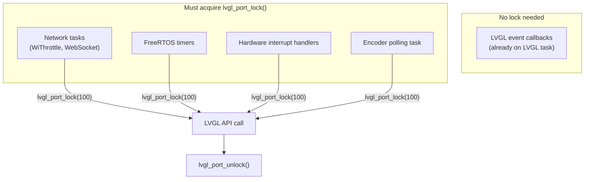
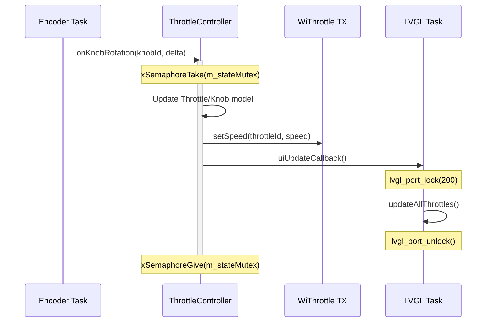
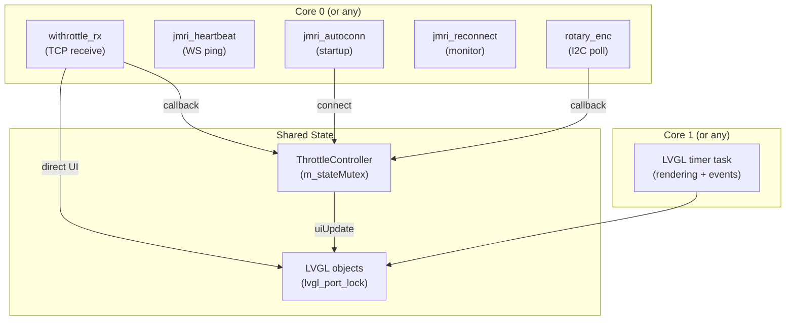

# Threading Model

## Overview

The ESP32-S3 is dual-core. LVGL rendering runs on a dedicated task; network I/O and hardware polling run on separate FreeRTOS tasks. All cross-task LVGL access is protected by a single mutex.

---

## Task Table

| Task Name | Stack | Priority | Purpose | Creates |
|-----------|-------|----------|---------|---------|
| `LVGL timer` | 6 KB | 2 | LVGL rendering + event handling | `lvgl_port.c` |
| `withrottle_rx` | 4 KB | 5 | WiThrottle TCP receive loop | `WiThrottleClient::connect()` |
| `jmri_heartbeat` | 2 KB | 5 | JSON WebSocket ping every 30 s | `JmriJsonClient::startHeartbeat()` |
| `jmri_autoconn` | 4 KB | 5 | Wait for WiFi → auto-connect JMRI | `JmriConnectionController::startAutoConnectTask()` |
| `jmri_reconnect` | 3 KB | 4 | Monitor connections, exponential backoff | `JmriConnectionController::enableAutoReconnect()` |
| `rotary_enc` | 3 KB | 4 | I2C encoder polling every 100 ms | `RotaryEncoderHal::startPollingTask()` |
| `throttle_poll` | — | Timer | `esp_timer`: query speed/direction every 10 s | `ThrottleController::initialize()` |

---

## LVGL Mutex Rules



### Timeout Guidelines

| Timeout | Use case | Behaviour if lock fails |
|---------|----------|------------------------|
| `100` ms | Frequent updates (speed, direction) | Skip this update — next one will succeed |
| `200` ms | UI refresh after state batch | Retry on next callback |
| `-1` (infinite) | Critical one-time updates (connection status, power change) | Block until available |

### Pattern

```cpp
// From any non-LVGL task:
void onNetworkCallback(void* data) {
    if (lvgl_port_lock(100)) {
        lv_label_set_text(label, "Updated");
        lvgl_port_unlock();
    } else {
        ESP_LOGW(TAG, "LVGL lock busy, skipping UI update");
    }
}
```

---

## Thread Safety in ThrottleController

`ThrottleController` protects all throttle/knob state with its own `m_stateMutex` (FreeRTOS mutex). This is a **separate** mutex from the LVGL port lock.



**Lock ordering:** Always acquire `m_stateMutex` before `lvgl_port_lock` — never the reverse — to prevent deadlocks.

---

## Concurrency Diagram



> **Note:** ESP-IDF does not pin most tasks to specific cores by default. The diagram shows logical separation — in practice tasks may migrate between cores.
