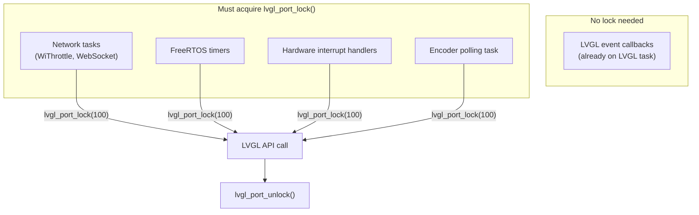
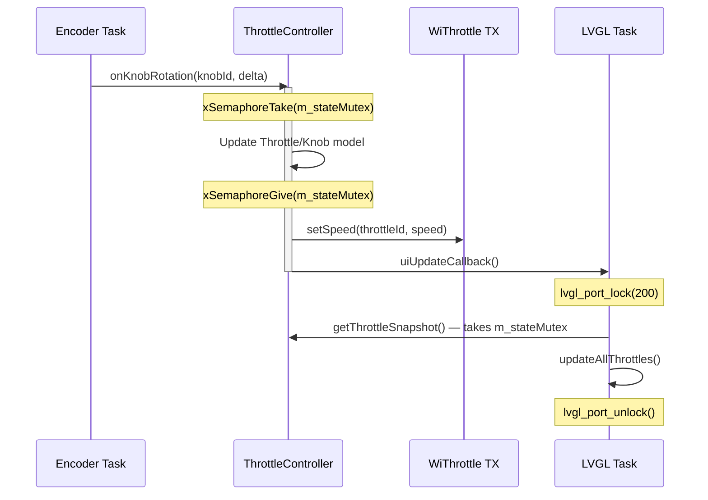
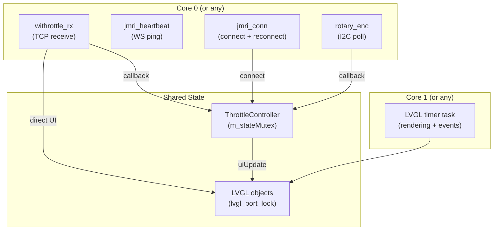

# Threading Model

## Overview

The ESP32-S3 is dual-core. LVGL rendering runs on a dedicated task; network I/O and hardware polling run on separate FreeRTOS tasks. All cross-task LVGL access is protected by a single mutex.

---

## Task Table

| Task Name | Stack | Priority | Purpose | Creates |
|-----------|-------|----------|---------|---------|
| `lvgl` | 6 KB | 2 | LVGL rendering + event handling | `lvgl_port.c` |
| `withrottle_rx` | 4 KB | 5 | WiThrottle TCP receive loop; also sends the `*` heartbeat | `WiThrottleClient::connect()` |
| `jmri_heartbeat` | 3 KB | 5 | JSON WebSocket ping every 30 s; stopped cooperatively, never deleted mid-send | `JmriJsonClient::startHeartbeat()` |
| `jmri_conn` | 6 KB | 4 | Every JMRI connect and disconnect: waits for WiFi, keeps both links up with backoff, carries out the config screen's requests | `JmriConnectionController::start()` |
| `rotary_enc` | 3 KB | 4 | I2C encoder polling every 100 ms | `RotaryEncoderHal::startPollingTask()` |
| `throttle_poll` | 4 KB | 3 | Refresh speed/direction every 10 s, for allocated throttles only | `ThrottleController::initialize()` |
| `orch_connect` | 6 KB | 5 | Supervises the orchestrator link for the life of the app: login once WiFi is up, retries with backoff, fresh login when the socket stays down; woken by the config screen's Connect | `AppController::startOrchestratorConnectTask()` |
| `websocket_task` | 6 KB (orchestrator), 4 KB (JMRI JSON) | — | WebSocket receive loop, owned by `esp_websocket_client`. One per client; only the selected transport's exists | `OrchestratorClient::connect()`, `JmriJsonClient::connect()` |
| `settings_writer` | 4 KB | 3 | Every NVS write the UI asks for, in the order asked (F-39) | `AppController::initialise()` |
| `track_power` | 4 KB | 5 | One-shot track-power write | `ThrottleController::requestTrackPower()` |
| `wifi_scan` | 4 KB | 4 | One-shot: runs a WiFi scan for the config screen and fills its list | `WiFiConfigScreen` Scan button |
| `stack_report` | 3 KB | 1 | Diagnostics only, and only with `CONFIG_THROTTLE_STACK_REPORT` (F-33) | `AppController::initialise()` |

Callbacks of ours also run on ESP-IDF's own tasks, whose stacks are set in `sdkconfig`:
WiFi and IP events on `sys_evt` (2304 bytes), the WiFi retry timer on `esp_timer`
(3584), and `app_main` on `main` (3584).

**The sizes above are allocations, not measurements.** `rotary_enc` and `withrottle_rx`
both run the main screen's whole repaint on their own stacks, which is what made them the
worry in F-33. FreeRTOS's end-of-stack canary (`CONFIG_FREERTOS_CHECK_STACKOVERFLOW_CANARY`,
on by default) turns most overflows into a panic naming the task. It checks only at a
context switch, though, and an overflow can corrupt its neighbours before then. To measure,
build with `CONFIG_THROTTLE_STACK_REPORT=y` (menuconfig → ESP-Layout-Controller
Configuration → Diagnostics). Then drive under load: all four throttles, screen changes, a
reconnect, a WiFi scan and a power toggle. Record each task's lowest "bytes never used"
figure here, and resize anything left with less than about 25% of its stack.

| Task | Allocated | Least free, measured on the bench |
|------|-----------|-----------------------------------|
| `lvgl` | 6144 | not yet measured |
| `rotary_enc` | 3072 | not yet measured |
| `withrottle_rx` | 4096 | not yet measured |
| `jmri_heartbeat` | 3072 | not yet measured |
| `jmri_conn` | 6144 | not yet measured |
| `orch_connect` | 6144 | not yet measured |
| `websocket_task` | 6144 / 4096 | not yet measured |
| `throttle_poll` | 4096 | not yet measured |
| `settings_writer` | 4096 | not yet measured |
| `track_power` | 4096 | not yet measured |
| `wifi_scan` | 4096 | not yet measured |
| `sys_evt` | 2304 | not yet measured |

`throttle_poll` is created **only when the active `ThrottleBackend` reports
`requiresPolling()`**. WiThrottle does, because it answers queries rather than volunteering
state; the orchestrator pushes `LOCO_STATE` unprompted, so under that transport no polling
task is created at all and its 4 KB stack is never allocated.

**Only the selected transport's tasks run.** `AppController::initialise()` reads
`TransportSettings` before anything connects: under WiThrottle the `jmri_*` tasks start and
no orchestrator task does; under the orchestrator, `orch_connect` starts and JMRI
auto-connect is never begun. Nothing sits retrying a server the operator has not chosen.

`orch_connect` and `track_power` both exist for the same reason: the
orchestrator's login, roster read and power command are **blocking HTTP round trips**, and
none of that may happen on the LVGL task (F-05). `track_power` in particular is spawned
straight from a button handler and is one-shot; `orch_connect` runs for the life of the
application and is the only task that logs in (F-24). `jmri_conn` is the JMRI counterpart:
the only task that connects or disconnects either JMRI client (F-34).

---

## LVGL Mutex Rules


```mermaid
flowchart TD
    subgraph safe["No lock needed"]
        A["LVGL event callbacks\n(already on LVGL task)"]
    end

    subgraph lock["Must acquire lvgl_port_lock()"]
        B["Network tasks\n(WiThrottle, WebSocket)"]
        C["FreeRTOS timers"]
        D["Hardware interrupt handlers"]
        E["Encoder polling task"]
    end

    B -->|"lvgl_port_lock(100)"| F["LVGL API call"]
    C -->|"lvgl_port_lock(100)"| F
    D -->|"lvgl_port_lock(100)"| F
    E -->|"lvgl_port_lock(100)"| F
    F --> G["lvgl_port_unlock()"]
```

### Timeout Guidelines

| Timeout | Use case | Behaviour if lock fails |
|---------|----------|------------------------|
| `100` ms | Frequent updates (speed, direction) | Skip this update — next one will succeed |
| `200` ms | UI refresh after state batch | Retry on next callback |
| `-1` (infinite) | Critical one-time updates (connection status, power change) | Block until available |

### Pattern

```cpp
// From any non-LVGL task:
void onNetworkCallback(void* data) {
    if (lvgl_port_lock(100)) {
        lv_label_set_text(label, "Updated");
        lvgl_port_unlock();
    } else {
        ESP_LOGW(TAG, "LVGL lock busy, skipping UI update");
    }
}
```

---

## Thread Safety in ThrottleController

`ThrottleController` protects all throttle/knob state with its own `m_stateMutex` (FreeRTOS mutex). This is a **separate** mutex from the LVGL port lock.


```mermaid
sequenceDiagram
    participant Enc as Encoder Task
    participant TC as ThrottleController
    participant WT as WiThrottle TX
    participant UI as LVGL Task

    Enc->>TC: onKnobRotation(knobId, delta)
    activate TC
    Note over TC: xSemaphoreTake(m_stateMutex)
    TC->>TC: Update Throttle/Knob model
    Note over TC: xSemaphoreGive(m_stateMutex)
    TC->>WT: setSpeed(throttleId, speed)
    TC->>UI: uiUpdateCallback()
    deactivate TC
    Note over UI: lvgl_port_lock(200)
    UI->>TC: getThrottleSnapshot() — takes m_stateMutex
    UI->>UI: updateAllThrottles()
    Note over UI: lvgl_port_unlock()
```

**Lock ordering:** `lvgl_port_lock` before `m_stateMutex`, never the reverse. The UI takes the
LVGL lock and then reads the controller — every LVGL event handler and every repaint does — so
the controller releases its mutex before it sends or calls the UI (`updateUI()`, the
track-power callback). A controller path that called the UI while holding its mutex would
deadlock against any event handler. This was documented the other way round until F-29; the
code has always done it this way.

---

## Concurrency Diagram


```mermaid
flowchart TB
    subgraph core0["Core 0 (or any)"]
        WT["withrottle_rx\n(TCP receive)"]
        JH["jmri_heartbeat\n(WS ping)"]
        JR["jmri_conn\n(connect + reconnect)"]
        RE["rotary_enc\n(I2C poll)"]
    end

    subgraph core1["Core 1 (or any)"]
        LV["LVGL timer task\n(rendering + events)"]
    end

    subgraph shared["Shared State"]
        TC["ThrottleController\n(m_stateMutex)"]
        LP["LVGL objects\n(lvgl_port_lock)"]
    end

    WT -->|callback| TC
    RE -->|callback| TC
    TC -->|uiUpdate| LP
    WT -->|direct UI| LP
    JR -->|connect| TC
    LV --> LP
```

> **Note:** ESP-IDF does not pin most tasks to specific cores by default. The diagram shows logical separation — in practice tasks may migrate between cores.
