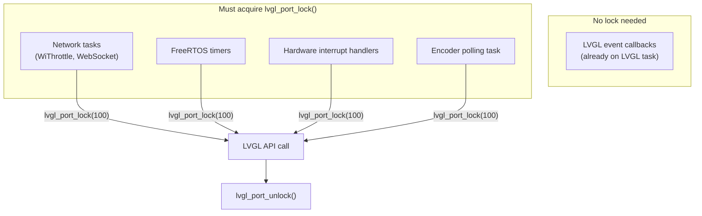
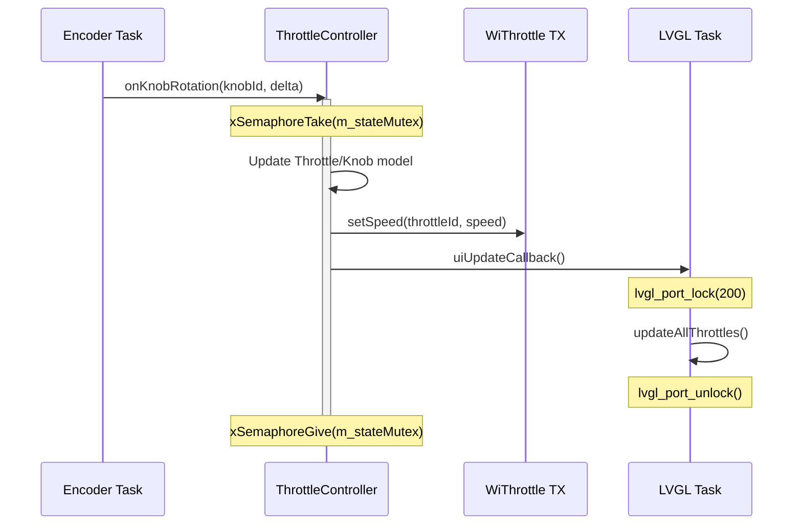
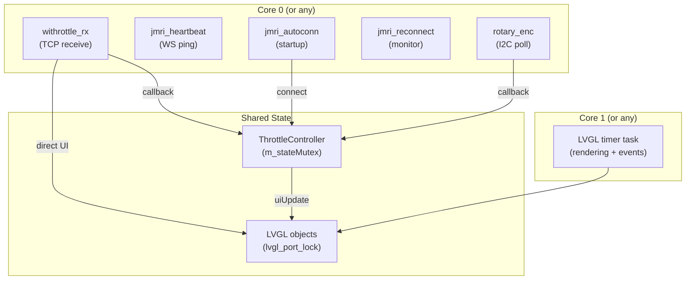

# Threading Model

## Overview

The ESP32-S3 is dual-core. LVGL rendering runs on a dedicated task; network I/O and hardware polling run on separate FreeRTOS tasks. All cross-task LVGL access is protected by a single mutex.

---

## Task Table

| Task Name | Stack | Priority | Purpose | Creates |
|-----------|-------|----------|---------|---------|
| `LVGL timer` | 6 KB | 2 | LVGL rendering + event handling | `lvgl_port.c` |
| `withrottle_rx` | 4 KB | 5 | WiThrottle TCP receive loop | `WiThrottleClient::connect()` |
| `jmri_heartbeat` | 2 KB | 5 | JSON WebSocket ping every 30 s | `JmriJsonClient::startHeartbeat()` |
| `jmri_autoconn` | 4 KB | 5 | Wait for WiFi → auto-connect JMRI | `JmriConnectionController::startAutoConnectTask()` |
| `jmri_reconnect` | 3 KB | 4 | Monitor connections, exponential backoff | `JmriConnectionController::enableAutoReconnect()` |
| `rotary_enc` | 3 KB | 4 | I2C encoder polling every 100 ms | `RotaryEncoderHal::startPollingTask()` |
| `throttle_poll` | 4 KB | 3 | Refresh speed/direction every 10 s, for allocated throttles only | `ThrottleController::initialize()` |
| `orch_connect` | 6 KB | 5 | Wait for WiFi → orchestrator login → fetch roster | `AppController::startOrchestratorConnectTask()` |
| `orch_ui_conn` | 6 KB | 5 | Same, triggered by the config screen's Connect button | `OrchestratorConfigScreen::onConnectClicked()` |
| `websocket_task` | 6 KB | — | Orchestrator control-plane receive loop (owned by `esp_websocket_client`) | `OrchestratorClient::connect()` |

`throttle_poll` is created **only when the active `ThrottleBackend` reports
`requiresPolling()`**. WiThrottle does, because it answers queries rather than volunteering
state; the orchestrator pushes `LOCO_STATE` unprompted, so under that transport no polling
task is created at all and its 4 KB stack is never allocated.

**Only the selected transport's tasks run.** `AppController::initialise()` reads
`TransportSettings` before anything connects: under WiThrottle the `jmri_*` tasks start and
no orchestrator task does; under the orchestrator, `orch_connect` starts and JMRI
auto-connect is never begun. Nothing sits retrying a server the operator has not chosen.

`orch_connect` and `orch_ui_conn` both exist because the orchestrator login is a **blocking
HTTP round trip** and the roster is two more. None of that may happen on the LVGL task
(F-05). Both are one-shot: they delete themselves when done.

---

## LVGL Mutex Rules


```mermaid
flowchart TD
    subgraph safe["No lock needed"]
        A["LVGL event callbacks\n(already on LVGL task)"]
    end

    subgraph lock["Must acquire lvgl_port_lock()"]
        B["Network tasks\n(WiThrottle, WebSocket)"]
        C["FreeRTOS timers"]
        D["Hardware interrupt handlers"]
        E["Encoder polling task"]
    end

    B -->|"lvgl_port_lock(100)"| F["LVGL API call"]
    C -->|"lvgl_port_lock(100)"| F
    D -->|"lvgl_port_lock(100)"| F
    E -->|"lvgl_port_lock(100)"| F
    F --> G["lvgl_port_unlock()"]
```

### Timeout Guidelines

| Timeout | Use case | Behaviour if lock fails |
|---------|----------|------------------------|
| `100` ms | Frequent updates (speed, direction) | Skip this update — next one will succeed |
| `200` ms | UI refresh after state batch | Retry on next callback |
| `-1` (infinite) | Critical one-time updates (connection status, power change) | Block until available |

### Pattern

```cpp
// From any non-LVGL task:
void onNetworkCallback(void* data) {
    if (lvgl_port_lock(100)) {
        lv_label_set_text(label, "Updated");
        lvgl_port_unlock();
    } else {
        ESP_LOGW(TAG, "LVGL lock busy, skipping UI update");
    }
}
```

---

## Thread Safety in ThrottleController

`ThrottleController` protects all throttle/knob state with its own `m_stateMutex` (FreeRTOS mutex). This is a **separate** mutex from the LVGL port lock.


```mermaid
sequenceDiagram
    participant Enc as Encoder Task
    participant TC as ThrottleController
    participant WT as WiThrottle TX
    participant UI as LVGL Task

    Enc->>TC: onKnobRotation(knobId, delta)
    activate TC
    Note over TC: xSemaphoreTake(m_stateMutex)
    TC->>TC: Update Throttle/Knob model
    TC->>WT: setSpeed(throttleId, speed)
    TC->>UI: uiUpdateCallback()
    Note over UI: lvgl_port_lock(200)
    UI->>UI: updateAllThrottles()
    Note over UI: lvgl_port_unlock()
    Note over TC: xSemaphoreGive(m_stateMutex)
    deactivate TC
```

**Lock ordering:** Always acquire `m_stateMutex` before `lvgl_port_lock` — never the reverse — to prevent deadlocks.

---

## Concurrency Diagram


```mermaid
flowchart TB
    subgraph core0["Core 0 (or any)"]
        WT["withrottle_rx\n(TCP receive)"]
        JH["jmri_heartbeat\n(WS ping)"]
        JA["jmri_autoconn\n(startup)"]
        JR["jmri_reconnect\n(monitor)"]
        RE["rotary_enc\n(I2C poll)"]
    end

    subgraph core1["Core 1 (or any)"]
        LV["LVGL timer task\n(rendering + events)"]
    end

    subgraph shared["Shared State"]
        TC["ThrottleController\n(m_stateMutex)"]
        LP["LVGL objects\n(lvgl_port_lock)"]
    end

    WT -->|callback| TC
    RE -->|callback| TC
    TC -->|uiUpdate| LP
    WT -->|direct UI| LP
    JA -->|connect| TC
    LV --> LP
```

> **Note:** ESP-IDF does not pin most tasks to specific cores by default. The diagram shows logical separation — in practice tasks may migrate between cores.
