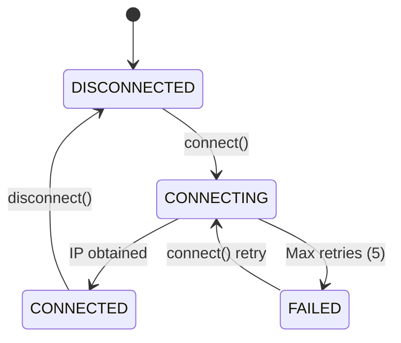
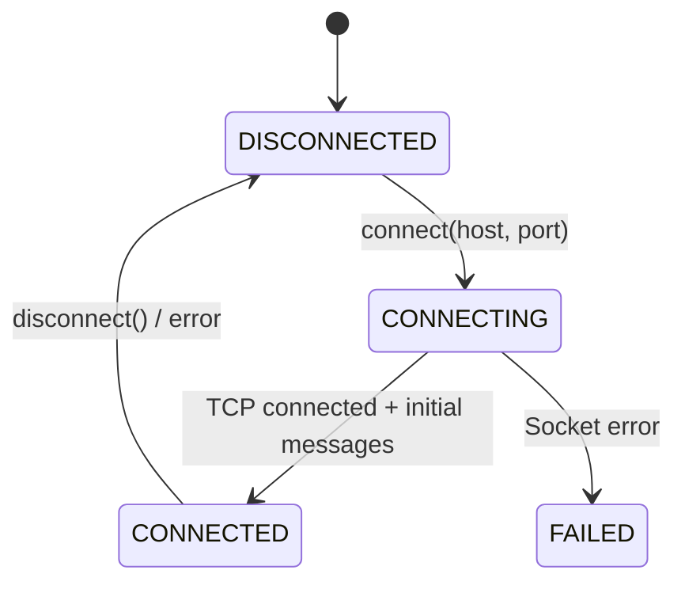

# Communication Layer

## WiFiManager

**File:** `main/communication/WiFiManager.cpp/h`

### Purpose

Manages WiFi STA mode connection with NVS credential persistence and network scanning.

### State Machine

### API

| Method | Description |
|--------|-------------|
| `initialize()` | Init NVS, WiFi driver, event handlers |
| `connect()` | Connect using stored NVS credentials |
| `connect(ssid, password)` | Connect with explicit credentials, save to NVS on success |
| `disconnect()` | Disconnect WiFi STA |
| `forgetNetwork()` | Erase NVS credentials |
| `startScan()` | Trigger async AP scan |
| `getScanResults()` | Return vector of discovered APs |
| `hasStoredCredentials()` | Check NVS for saved SSID |
| `getStoredSsid()` | Read SSID from NVS |
| `getIpAddress()` | Current IP as string |
| `setStateCallback(fn)` | `fn(State, string ip)` |

### NVS

Namespace: `wifi`, Keys: `ssid`, `password`

---

## WiThrottleClient

**File:** `main/communication/WiThrottleClient.cpp/h`

### Purpose

Full WiThrottle v2.0 TCP protocol client — roster retrieval, multi-throttle control, heartbeat, and power state.

### Connection States

### API — Connection

| Method | Description |
|--------|-------------|
| `initialize()` | Prepare client state |
| `connect(host, port=12090)` | TCP connect, send device ID, start receive task |
| `disconnect()` | Close socket, stop tasks |
| `isConnected()` | Check connection state |
| `sendHeartbeat()` | Send `*` keepalive |

### API — Throttle Control

| Method | WiThrottle Command | Description |
|--------|-------------------|-------------|
| `acquireLocomotive(id, addr, isLong)` | `M<id>+<key><;><addr>` | Add loco to throttle |
| `releaseLocomotive(id)` | `M<id>-*<;>r` | Release loco from throttle |
| `setSpeed(id, speed)` | `M<id>A*<;>V<speed>` | Set speed 0–126 |
| `setDirection(id, forward)` | `M<id>A*<;>R<0\|1>` | Set direction |
| `setFunction(id, fn, state)` | `M<id>A*<;>F<state><fn>` | Function on/off |
| `querySpeed(id)` | `M<id>A*<;>qV` | Query current speed |
| `queryDirection(id)` | `M<id>A*<;>qR` | Query current direction |
| `setTrackPower(track, on)` | `PPA<0\|1>` | Track power via WiThrottle |

### Callbacks

| Callback | Signature | Fires when |
|----------|-----------|------------|
| `ConnectionStateCallback` | `(ConnectionState)` | Connection changes |
| `RosterCallback` | `(vector<Locomotive>)` | Roster received (`RL`) |
| `PowerStateCallback` | `(PowerState)` | Power state received (`PPA`) |
| `WebPortCallback` | `(int port)` | Web port received (`PW`) |
| `ThrottleStateCallback` | `(ThrottleUpdate)` | Speed/dir/function update (`M<id>A`) |
| `FunctionLabelsCallback` | `(char id, vector<string>)` | Function labels received (`M<id>L`) |

### Threading

- `withrottle_rx` task (4 KB, priority 5): blocking `recv()` loop, parses messages, fires callbacks.
- `m_stateMutex`: protects internal `m_throttleStates` map.
- All callbacks fire from the receive task — callers must handle their own locking.

### Protocol Messages Parsed

| Prefix | Example | Meaning |
|--------|---------|---------|
| `VN` | `VN2.0` | Protocol version |
| `RL` | `RL2]\[RGS 41}|{41}|{L]\[...` | Roster list |
| `PPA` | `PPA1` | Track power (0=off, 1=on, 2=unknown) |
| `PW` | `PW12080` | Web server port |
| `M<id>A` | `M0AL41<;>V50` | Throttle action (speed/dir/function) |
| `M<id>L` | `M0LL41<;>]\[Headlight]\[...` | Function labels |
| `M<id>+` | `M0+L41<;>` | Loco added confirmation |
| `M<id>-` | `M0-L41<;>` | Loco removed confirmation |
| `*` | `*10` | Heartbeat interval |

---

## JmriJsonClient

**File:** `main/communication/JmriJsonClient.cpp/h`

### Purpose

JMRI JSON WebSocket client for track power control. Connects to the JMRI web server's `/json/` endpoint.

### Connection States

Same as WiThrottleClient: `DISCONNECTED → CONNECTING → CONNECTED / FAILED`.

### API

| Method | Description |
|--------|-------------|
| `initialize()` | Prepare client state |
| `connect(host, port=12080)` | WebSocket connect to `ws://<host>:<port>/json/` |
| `disconnect()` | Close WebSocket |
| `setPower(bool on)` | Send power command for configured power manager |
| `getPower()` | Request current power state |
| `requestPowerList()` | Request all power managers |
| `startHeartbeat()` | Spawn heartbeat task (ping every 30 s) |
| `stopHeartbeat()` | Stop heartbeat task |
| `setConfiguredPowerName(name)` | Set power manager name (e.g. `"DCC++"`) |

### Callbacks

| Callback | Signature | Fires when |
|----------|-----------|------------|
| `PowerStateCallback` | `(string name, PowerState)` | Power state change |
| `ConnectionStateCallback` | `(ConnectionState)` | Connection change |

### JSON Messages

| Direction | Example |
|-----------|---------|
| Send power ON | `{"type":"power","data":{"name":"DCC++","state":2}}` |
| Send power OFF | `{"type":"power","data":{"name":"DCC++","state":4}}` |
| Receive power | `{"type":"power","data":{"name":"DCC++","state":2,"default":true}}` |
| Send ping | `{"type":"ping"}` |
| Receive pong | `{"type":"pong"}` |

### Power State Mapping

| JSON `state` | Enum | Meaning |
|--------------|------|---------|
| `2` | `ON` | Power on |
| `4` | `OFF` | Power off |
| `0` | `UNKNOWN` | Unknown |
