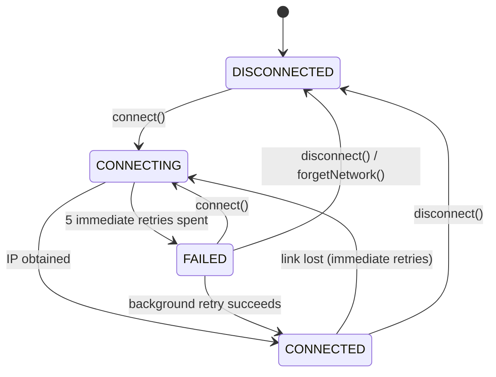
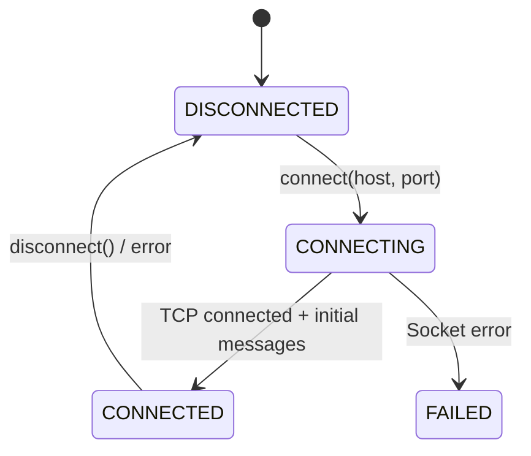

# Communication Layer

## ThrottleBackend (port)

**File:** `main/communication/ThrottleBackend.h` — interface only, no `.cpp`.

### Purpose

The transport-neutral seam for driving locomotives. `ThrottleController` depends on this
and never on a concrete client, so a second transport can be added without the controller
layer learning either protocol's wire format.

The interface is drawn at "throttle N drives loco A at speed S". Throttle identifiers are
plain `int` indices; WiThrottle's `'0' + id` character encoding is a wire detail that stays
behind the adapter.

### Capability queries

Rather than making one protocol impersonate the other, the port asks each backend what it
can do. WiThrottle is session-oriented and the layout orchestrator's control plane is not,
and that difference surfaces here rather than as a fake session.

| Query | Meaning when false |
|-------|--------------------|
| `requiresAcquisition()` | Locos are addressed directly; acquire/release are local bookkeeping |
| `providesRoster()` | No selectable roster — the controller must not offer loco selection |
| `providesFunctionLabels()` | UI falls back to `F0`…`F28` |
| `requiresPolling()` | State arrives unprompted; no `throttle_poll` task is created |
| `functionCommandIsButtonEvent()` | `setFunction()` sets a state outright (orchestrator), so the controller toggles on press and ignores the release (F-28). True for WiThrottle, where JMRI applies latching to press and release |
| `supportsTrackPower()` | The power button is **hidden**, not left dead |

### Emergency stop

`emergencyStop()` stops everything the transport can, each in its own terms (F-27): the
orchestrator's `EMERGENCY_STOP` halts the **whole layout**; WiThrottle has no layout-wide
command, so it sends `X` to every loco this device holds. The controller shows the throttles
as stopped only once the stop has actually been sent.

### Refused commands (orchestrator)

The orchestrator answers a refused command — one sent while the system is `offline`, say —
with an `ERROR` that names no command. By then the controller has already shown what was asked
for, so `OrchestratorBackend` re-seeds every assigned throttle from the layout's last reported
state (F-25). The send itself succeeded, so rolling back on a failed send cannot catch this.

`OrchestratorClient::m_client` is guarded by its own mutex, held across each send and across a
re-login's stop and destroy, so a re-login cannot free the handle under a sender (F-26).

### Track power lives on this port too

Strictly a layout command rather than a throttle one, but it rides the same
connection and the UI needs one place to ask — so it is here rather than in a second
port with two more adapters.

`TrackPower::UNKNOWN` is **not** "off". It means nothing has told us yet, and showing it as
off would claim the rails are dead when nobody knows. The UI renders it as its own state.

Everything the UI needs — connection state, knob gating, functions, track power — comes
through `ThrottleController` and this port. Reaching past it into a concrete client is the
bug that made the orchestrator transport look dead: the knobs were gated on
`WiThrottleClient::isConnected()`, and the power bar read `JmriJsonClient` directly, neither
of which is connected when the orchestrator is the selected transport.

### Threading

Implementations are called from the LVGL task (through the controller's event handlers) and
from the polling task, so every method must be safe on more than one task. Callbacks fire on
whichever task the transport receives on — never assume the LVGL task, and take
`lvgl_port_lock` before touching a widget from one.

Every callback slot, on the backends and on the clients beneath them, is a `CallbackSlot`
(`main/utils/CallbackSlot.h`). It is set under its own lock, and the callback is invoked as a
copy with that lock released (F-30). Clearing a slot does not wait for a call already in
flight, so whatever a callback reaches must outlive the clear — one reason `MainScreen` is
never destroyed.

---

## WiThrottleBackend

**File:** `main/communication/WiThrottleBackend.cpp/h`

### Purpose

Adapts `WiThrottleClient` to the `ThrottleBackend` port. Owns nothing — the client is
injected and outlives it. Translation only: throttle indices to WiThrottle's character ids,
roster entries to the port's shape, and the two separate speed/direction queries to one
`refreshThrottleState`. Answers `true` to all four capability queries.

Out-of-range throttle ids arriving from the wire are dropped here rather than passed up as
negative indices.

---

## OrchestratorClient

**File:** `main/communication/OrchestratorClient.cpp/h`

### Purpose

Speaks the layout orchestrator's WebSocket control plane — the `ClientMessage` /
`ServerMessage` vocabulary defined in `bazauto/layout-orchestration` →
`packages/backend/src/domain/types.ts`, which is authoritative for this firmware.

**MQTT is not this device's transport.** MQTT is the hardware telemetry bus for the sensor
and point boards; this is an operator device and the WebSocket is the operator control plane.

### Connecting is two steps

The orchestrator authenticates with a session cookie, not a bearer token:

1. `POST /api/auth/login` with the credentials; capture the session token from the
   `Set-Cookie` response header.
2. Open `/ws` with that token sent back as a `Cookie` request header
   (`esp_websocket_client_config_t::headers`).

Auth is enforced only at the upgrade. Once the socket is open nothing tears it down for an
auth reason — deliberate on the server side, so a session expiring never drops a connection
while a train is moving.

The login is **blocking**, so it never runs on the LVGL task (F-05). See
[THREADING_MODEL.md](../architecture/THREADING_MODEL.md) for `orch_connect`.

### Messages handled

| Inbound | Effect |
|---------|--------|
| `STATE_SNAPSHOT` | Applies every loco's state and the system status, and replaces the per-loco state cache. **Display only** — never replayed outward as a command. |
| `LOCO_STATE` | One loco's speed, direction and functions. |
| `SYSTEM_STATUS` | Online / safe-stop / offline, with reason. |
| `HEARTBEAT` | Liveness timestamp only (`secondsSinceLastMessage()`). |
| `ERROR` | Logged; the orchestrator refused a command. |

Blocks, points, routes, sensors and faults are real messages this device has no use for.
They are ignored, not treated as errors.

| Outbound | When |
|----------|------|
| `THROTTLE_COMMAND` | Speed **and** direction together — the contract has no speed-only command. |
| `FUNCTION_COMMAND` | One function toggled. |
| `EMERGENCY_STOP` | No payload, and no loco address: it halts the layout, not a loco. |

### Parsing refuses rather than guesses

Parsed with cJSON, not by substring search. This is the difference `CLAUDE.md` calls out
against `JmriJsonClient`: a malformed orchestrator payload must be **rejected outright**,
because the half that survived a partial parse would become a speed command on real track.

Refused, each with a log line and no callback:

- unparseable JSON, or a frame with no `type`
- a `LOCO_STATE` with a missing or non-positive address
- a speed that is absent, non-numeric, **non-integral** (cJSON reports every number as a
  double, so `64.7` would otherwise truncate into a speed), or outside 0–126
- a direction that is not `fwd`, `rev` or `stop`
- a system status that is not `online`, `safe-stop` or `offline`

Within a `STATE_SNAPSHOT`, one bad loco entry is skipped without costing the rest.

A message split across frames (a text frame without FIN, then continuations) is reassembled
before it is parsed, up to 24 KB. The receive buffer used to be cleared at every frame's
start, which parsed each fragment alone and refused them all (F-42). The connection, system
and track-power states are atomics, so no lock timeout can lose a change.

### Roster and track power are REST, not WebSocket

The `ClientMessage` union has no track-power member and the snapshot carries loco state keyed
by address but no names, so both are HTTP:

| Need | Call |
|------|------|
| Roster | `GET /api/layouts/{id}/locos` |
| Track power | `POST /api/layouts/{id}/dcc-link/power` with `{"on": bool}` |

The layout id comes from `GET /api/layouts`, fetched once per login and cached; a new host
never inherits the old one's id. The orchestrator runs one layout, and the first is used —
with a warning if there is ever more than one (F-42).

The roster is **streamed**. `JsonArraySplitter` hands over each loco record as its closing
brace arrives, and each is parsed with cJSON on its own, so memory is bounded by one record
rather than by a response buffer. The old 8 KB buffer refused any roster above about 35 locos
whole (F-35). The limits are 4 KB per record, with room for the function labels the
orchestrator is gaining, and 128 locos:

| What arrives | What happens |
|--------------|--------------|
| A record over 4 KB | That loco is skipped, with a warning |
| A record with no positive address | That loco is skipped, as before |
| More than 128 locos | The first 128 are kept, with a warning |
| A record cJSON cannot parse, or a stream that is not an array of objects | The whole roster is refused |
| A stream that stops before its closing `]` | The whole roster is refused |

The roster is built aside and swapped in, so a partly-built roster is never visible to the
carousel.

The power POST's **reply body is deliberately ignored**. The `DCC_LINK` event pushed the
moment it lands is what tells us the truth — that is the route's own contract, not our
preference. `DCC_LINK` is also read off the snapshot, so the button is right from the first
frame rather than waiting for the next change.

### CONFIG_WS_BUFFER_SIZE, and why it is not the client's buffer_size

`esp_websocket_client_config_t::buffer_size` is the **frame** buffer. The HTTP Upgrade
handshake is built and read in a *separate* buffer sized by `CONFIG_WS_BUFFER_SIZE`
(`sdkconfig.defaults`). Raising the former does nothing for the latter.

`transport_ws` reads until it finds the header terminator, then **still fails** if the buffer
filled. The orchestrator pushes a whole-layout `STATE_SNAPSHOT` the instant the socket opens,
so the `101` and a chunk of that snapshot regularly arrive in one TCP read — which is why
`transport_ws: Header size exceeded buffer size` was intermittent rather than constant. It
depends on packet timing, not on header length.

Set to **16384**. It must exceed the response *plus* whatever of the first frame arrives with
it, so a layout that grows enough to inflate the snapshot could eventually need more.

---

## OrchestratorBackend

**File:** `main/communication/OrchestratorBackend.cpp/h`

Adapts `OrchestratorClient` to the `ThrottleBackend` port. Capabilities:

| Query | Answer | Why |
|-------|--------|-----|
| `requiresAcquisition()` | **false** | No sessions; commands name a loco address outright |
| `providesRoster()` | true | Over REST, as above |
| `providesFunctionLabels()` | **false** | The `locos` table stores none yet, so the UI shows `F0`…`F28` |
| `requiresPolling()` | **false** | State arrives unprompted, so no `throttle_poll` task |

Because the orchestrator has no sessions, the throttle-to-loco mapping that WiThrottle keeps
server-side is kept **here** instead, and "acquire" is local bookkeeping rather than a
handshake. The adapter also shadows each throttle's last commanded speed and direction,
because `THROTTLE_COMMAND` carries both together and a caller changing one still has to
supply the other.

**Acquire starts from what the loco is doing.** `OrchestratorClient` keeps each loco's last
reported state (from the snapshot and every `LOCO_STATE`; emptied when the link drops), and
acquiring replays it to the new throttle exactly as a `LOCO_STATE` would arrive. Taking over a
loco another operator has at speed 60 therefore shows 60, and the next click moves from there
— starting from zero made that click command speed 4, or a reversal (F-20). This is the
display path only: nothing is sent on acquire.

**Release sends nothing.** There is no session to hand back, and this device is not the only
thing that can drive that loco — an automation run or another operator may be in charge of
it. Stopping it because one throttle stopped displaying it would be a movement nobody
commanded.

---

## WiFiManager

**File:** `main/communication/WiFiManager.cpp/h`

### Purpose

Manages WiFi STA mode connection with NVS credential persistence and network scanning.

### State Machine

```mermaid
stateDiagram-v2
    [*] --> DISCONNECTED
    DISCONNECTED --> CONNECTING : connect()
    CONNECTING --> CONNECTED : IP obtained
    CONNECTED --> CONNECTING : link lost (immediate retries)
    CONNECTING --> FAILED : 5 immediate retries spent
    FAILED --> CONNECTED : background retry succeeds
    FAILED --> CONNECTING : connect()
    CONNECTED --> DISCONNECTED : disconnect()
    FAILED --> DISCONNECTED : disconnect() / forgetNetwork()
```

### API

| Method | Description |
|--------|-------------|
| `initialize()` | Init NVS, WiFi driver, event handlers |
| `connect()` | Connect using stored NVS credentials |
| `connect(ssid, password)` | Connect with explicit credentials; saved to NVS only once they produce an IP (F-40) |
| `disconnect()` | Disconnect WiFi STA and stop retrying |
| `forgetNetwork()` | Erase NVS credentials |
| `startScan()` | Trigger async AP scan |
| `getScanResults()` | Return vector of discovered APs |
| `hasStoredCredentials()` | Check NVS for saved SSID |
| `getStoredSsid()` | Read SSID from NVS |
| `getIpAddress()` | Current IP as string |
| `setStateCallback(fn)` | `fn(State, string ip)` |

### Reconnection

After five immediate retries the state reports `FAILED`, but a one-shot `esp_timer` keeps
retrying — 5 s, doubling, capped at a minute — until the operator disconnects or forgets the
network (F-24). Giving up for good had meant a router reboot left the device offline, and
every throttle dead, until someone went into settings. The timer callback does nothing but
call `esp_wifi_connect()`, which returns at once, so it never blocks the shared `esp_timer`
task (F-09).

A failed `esp_wifi_set_config` — refused while the station is mid-connect — is reported as
`FAILED` rather than stopping the device through `ESP_ERROR_CHECK` (F-40).

### NVS

Namespace: `wifi`, Keys: `ssid`, `password`

---

## WiThrottleClient

**File:** `main/communication/WiThrottleClient.cpp/h`

### Purpose

Full WiThrottle v2.0 TCP protocol client — roster retrieval, multi-throttle control, heartbeat, and power state.

### Connection States

```mermaid
stateDiagram-v2
    [*] --> DISCONNECTED
    DISCONNECTED --> CONNECTING : connect(host, port)
    CONNECTING --> CONNECTED : TCP connected + initial messages
    CONNECTING --> FAILED : Socket error
    CONNECTED --> DISCONNECTED : disconnect() / error
```

### API — Connection

| Method | Description |
|--------|-------------|
| `initialize()` | Prepare client state |
| `connect(host, port=12090)` | Reap any previous session, TCP connect, send `HU<MAC>` and `N<name>`, start receive task, re-acquire every loco still on the record |
| `disconnect()` | Stop the receive task and close the socket. Keeps the acquisition record |
| `isConnected()` | Check connection state |
| `sendHeartbeat()` | Send `*` keepalive |
| `getHeartbeatPeriodMs()` | Heartbeat period this session, or 0 when the server does no monitoring |

### Sessions and the acquisition record

The client records every loco it acquires, per throttle. That record mirrors what the UI shows
as allocated, not what the current TCP session holds, so it survives a disconnect of either
kind: an explicit `disconnect()` or JMRI dropping the link. Every `connect()` re-acquires what
is on it, and JMRI answers with each loco's speed and direction, which re-seeds the display.
Only `releaseLocomotive()` removes an entry, whether or not the release reaches the server.

This is F-22's fix. Before it, a JMRI restart left the UI showing every throttle live while
the new session held nothing, so JMRI ignored the knob and the stop press alike; and the
reconnect overwrote the old socket without closing it, leaking one of lwIP's ten sockets
each time.

### Heartbeat (dead-man switch)

After `N`, JMRI announces its heartbeat interval as `*<seconds>`. A non-zero interval makes
the client send `*+`, which switches monitoring on, and then `*` at half the interval from the
receive task. If the heartbeats stop — the device crashed, rebooted, lost power or went
half-open on WiFi — JMRI e-stops this device's locos. Never sending `*+` had left that switch
off (F-23).

### API — Throttle Control

| Method | WiThrottle Command | Description |
|--------|-------------------|-------------|
| `acquireLocomotive(id, addr, isLong)` | `M<id>+<key><;><addr>` | Add loco to throttle |
| `releaseLocomotive(id)` | `M<id>-*<;>r` | Release loco from throttle |
| `setSpeed(id, speed)` | `M<id>A*<;>V<speed>` | Set speed 0–126 |
| `setDirection(id, forward)` | `M<id>A*<;>R<0\|1>` | Set direction |
| `setFunction(id, fn, state)` | `M<id>A*<;>F<state><fn>` | Function on/off |
| `querySpeed(id)` | `M<id>A*<;>qV` | Query current speed |
| `queryDirection(id)` | `M<id>A*<;>qR` | Query current direction |
| `setTrackPower(track, on)` | `PPA<0\|1>` | Track power via WiThrottle |

### Callbacks

| Callback | Signature | Fires when |
|----------|-----------|------------|
| `ConnectionStateCallback` | `(ConnectionState)` | Connection changes |
| `RosterCallback` | `(vector<Locomotive>)` | Roster received (`RL`) |
| `PowerStateCallback` | `(PowerState)` | Power state received (`PPA`) |
| `WebPortCallback` | `(int port)` | Web port received (`PW`) |
| `ThrottleStateCallback` | `(ThrottleUpdate)` | Speed/dir/function update (`M<id>A`) |
| `FunctionLabelsCallback` | `(char id, vector<string>)` | Function labels received (`M<id>L`) |

### Threading

- `withrottle_rx` task (4 KB, priority 5): `recv()` loop with a one-second timeout, so it
  notices a requested shutdown promptly and sends heartbeats when due. Parses messages and
  fires callbacks. It reads from its own copy of the descriptor; teardown clears `m_socket`
  under the send mutex before closing, so neither a send nor the receive loop can land on a
  descriptor lwIP has already handed to another socket.
- `m_stateMutex`: protects internal `m_throttleStates` map.
- All callbacks fire from the receive task — callers must handle their own locking.
- Each received line is logged at DEBUG, not INFO: a console write per line blocked this
  task (F-38).

### Protocol Messages Parsed

| Prefix | Example | Meaning |
|--------|---------|---------|
| `VN` | `VN2.0` | Protocol version |
| `RL` | `RL2]\[RGS 41}|{41}|{L]\[...` | Roster list |
| `PPA` | `PPA1` | Track power (0=off, 1=on, 2=unknown) |
| `PW` | `PW12080` | Web server port |
| `M<id>A` | `M0AL41<;>V50` | Throttle action (speed/dir/function) |
| `M<id>L` | `M0LL41<;>]\[Headlight]\[...` | Function labels |
| `M<id>+` | `M0+L41<;>` | Loco added confirmation |
| `M<id>-` | `M0-L41<;>` | Loco removed confirmation |
| `*` | `*10` | Heartbeat interval; non-zero arms monitoring with `*+` |

---

## JmriJsonClient

**File:** `main/communication/JmriJsonClient.cpp/h`

### Purpose

JMRI JSON WebSocket client for track power control. Connects to the JMRI web server's `/json/` endpoint.

### Connection States

Same as WiThrottleClient: `DISCONNECTED → CONNECTING → CONNECTED / FAILED`.

### API

| Method | Description |
|--------|-------------|
| `initialize()` | Prepare client state |
| `connect(host, port=12080)` | WebSocket connect to `ws://<host>:<port>/json/` |
| `disconnect()` | Close WebSocket |
| `setPower(bool on)` | Send power command for configured power manager |
| `getPower()` | Request current power state |
| `startHeartbeat()` | Spawn heartbeat task (ping every 30 s) |
| `stopHeartbeat()` | Stop heartbeat task and wait for it to exit (join, then delete). Up to about a second when the task is mid-send (F-31) |
| `setConfiguredPowerName(name)` | Set power manager name (e.g. `"DCC++"`) |

### Callbacks

| Callback | Signature | Fires when |
|----------|-----------|------------|
| `PowerStateCallback` | `(string name, PowerState)` | Power state change |
| `ConnectionStateCallback` | `(ConnectionState)` | Connection change |

### JSON Messages

| Direction | Example |
|-----------|---------|
| Send power ON | `{"type":"power","data":{"name":"DCC++","state":2}}` |
| Send power OFF | `{"type":"power","data":{"name":"DCC++","state":4}}` |
| Receive power | `{"type":"power","data":{"name":"DCC++","state":2,"default":true}}` |
| Send ping | `{"type":"ping"}` |
| Receive pong | `{"type":"pong"}` |

### Power State Mapping

| JSON `state` | Enum | Meaning |
|--------------|------|---------|
| `2` | `ON` | Power on |
| `4` | `OFF` | Power off |
| `0` | `UNKNOWN` | Unknown |
