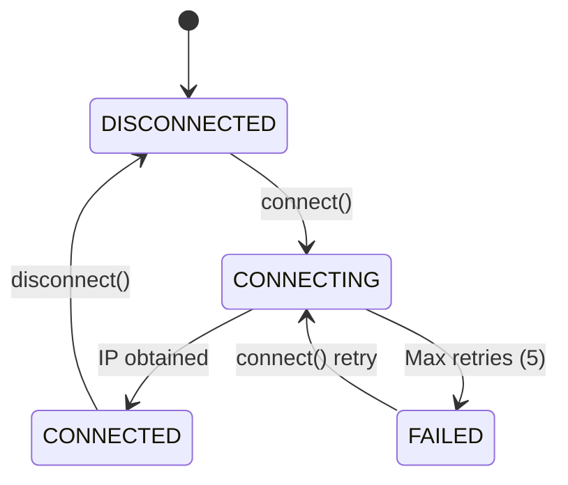
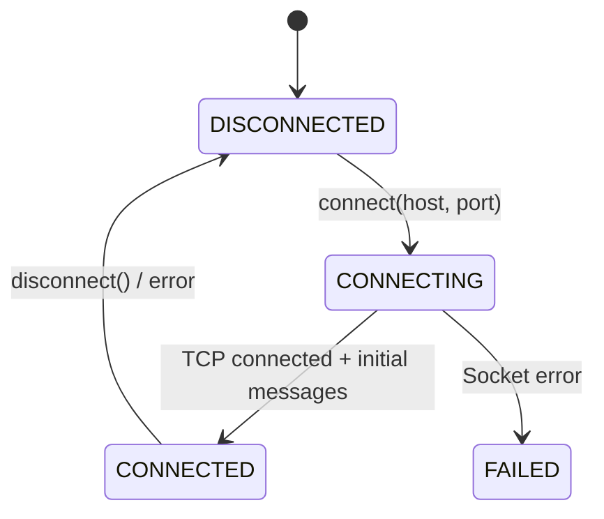

# Communication Layer

## ThrottleBackend (port)

**File:** `main/communication/ThrottleBackend.h` — interface only, no `.cpp`.

### Purpose

The transport-neutral seam for driving locomotives. `ThrottleController` depends on this
and never on a concrete client, so a second transport can be added without the controller
layer learning either protocol's wire format.

The interface is drawn at "throttle N drives loco A at speed S". Throttle identifiers are
plain `int` indices; WiThrottle's `'0' + id` character encoding is a wire detail that stays
behind the adapter.

### Capability queries

Rather than making one protocol impersonate the other, the port asks each backend what it
can do. WiThrottle is session-oriented and the layout orchestrator's control plane is not,
and that difference surfaces here rather than as a fake session.

| Query | Meaning when false |
|-------|--------------------|
| `requiresAcquisition()` | Locos are addressed directly; acquire/release are local bookkeeping |
| `providesRoster()` | No selectable roster — the controller must not offer loco selection |
| `providesFunctionLabels()` | UI falls back to `F0`…`F28` |
| `requiresPolling()` | State arrives unprompted; no `throttle_poll` task is created |

### Threading

Implementations are called from the LVGL task (through the controller's event handlers) and
from the polling task, so every method must be safe on more than one task. Callbacks fire on
whichever task the transport receives on — never assume the LVGL task, and take
`lvgl_port_lock` before touching a widget from one.

---

## WiThrottleBackend

**File:** `main/communication/WiThrottleBackend.cpp/h`

### Purpose

Adapts `WiThrottleClient` to the `ThrottleBackend` port. Owns nothing — the client is
injected and outlives it. Translation only: throttle indices to WiThrottle's character ids,
roster entries to the port's shape, and the two separate speed/direction queries to one
`refreshThrottleState`. Answers `true` to all four capability queries.

Out-of-range throttle ids arriving from the wire are dropped here rather than passed up as
negative indices.

---

## OrchestratorClient

**File:** `main/communication/OrchestratorClient.cpp/h`

### Purpose

Speaks the layout orchestrator's WebSocket control plane — the `ClientMessage` /
`ServerMessage` vocabulary defined in `bazauto/layout-orchestration` →
`packages/backend/src/domain/types.ts`, which is authoritative for this firmware.

**MQTT is not this device's transport.** MQTT is the hardware telemetry bus for the sensor
and point boards; this is an operator device and the WebSocket is the operator control plane.

### Connecting is two steps

The orchestrator authenticates with a session cookie, not a bearer token:

1. `POST /api/auth/login` with the credentials; capture the session token from the
   `Set-Cookie` response header.
2. Open `/ws` with that token sent back as a `Cookie` request header
   (`esp_websocket_client_config_t::headers`).

Auth is enforced only at the upgrade. Once the socket is open nothing tears it down for an
auth reason — deliberate on the server side, so a session expiring never drops a connection
while a train is moving.

The login is **blocking**, so it never runs on the LVGL task (F-05). See
[THREADING_MODEL.md](../architecture/THREADING_MODEL.md) for `orch_connect`.

### Messages handled

| Inbound | Effect |
|---------|--------|
| `STATE_SNAPSHOT` | Applies every loco's state and the system status. **Display only** — never replayed outward as a command. |
| `LOCO_STATE` | One loco's speed, direction and functions. |
| `SYSTEM_STATUS` | Online / safe-stop / offline, with reason. |
| `HEARTBEAT` | Liveness timestamp only (`secondsSinceLastMessage()`). |
| `ERROR` | Logged; the orchestrator refused a command. |

Blocks, points, routes, sensors and faults are real messages this device has no use for.
They are ignored, not treated as errors.

| Outbound | When |
|----------|------|
| `THROTTLE_COMMAND` | Speed **and** direction together — the contract has no speed-only command. |
| `FUNCTION_COMMAND` | One function toggled. |
| `EMERGENCY_STOP` | No payload, and no loco address: it halts the layout, not a loco. |

### Parsing refuses rather than guesses

Parsed with cJSON, not by substring search. This is the difference `CLAUDE.md` calls out
against `JmriJsonClient`: a malformed orchestrator payload must be **rejected outright**,
because the half that survived a partial parse would become a speed command on real track.

Refused, each with a log line and no callback:

- unparseable JSON, or a frame with no `type`
- a `LOCO_STATE` with a missing or non-positive address
- a speed that is absent, non-numeric, **non-integral** (cJSON reports every number as a
  double, so `64.7` would otherwise truncate into a speed), or outside 0–126
- a direction that is not `fwd`, `rev` or `stop`
- a system status that is not `online`, `safe-stop` or `offline`

Within a `STATE_SNAPSHOT`, one bad loco entry is skipped without costing the rest.

### Roster

A REST read (`GET /api/layouts/{id}/locos`), not a control-plane message: the snapshot
carries loco state keyed by address but no names. The layout id comes from `GET /api/layouts`.
Built aside and swapped in, so a partly-built roster is never visible to the carousel.

---

## OrchestratorBackend

**File:** `main/communication/OrchestratorBackend.cpp/h`

Adapts `OrchestratorClient` to the `ThrottleBackend` port. Capabilities:

| Query | Answer | Why |
|-------|--------|-----|
| `requiresAcquisition()` | **false** | No sessions; commands name a loco address outright |
| `providesRoster()` | true | Over REST, as above |
| `providesFunctionLabels()` | **false** | The `locos` table stores none yet, so the UI shows `F0`…`F28` |
| `requiresPolling()` | **false** | State arrives unprompted, so no `throttle_poll` task |

Because the orchestrator has no sessions, the throttle-to-loco mapping that WiThrottle keeps
server-side is kept **here** instead, and "acquire" is local bookkeeping rather than a
handshake. The adapter also shadows each throttle's last commanded speed and direction,
because `THROTTLE_COMMAND` carries both together and a caller changing one still has to
supply the other.

**Release sends nothing.** There is no session to hand back, and this device is not the only
thing that can drive that loco — an automation run or another operator may be in charge of
it. Stopping it because one throttle stopped displaying it would be a movement nobody
commanded.

---

## WiFiManager

**File:** `main/communication/WiFiManager.cpp/h`

### Purpose

Manages WiFi STA mode connection with NVS credential persistence and network scanning.

### State Machine

```mermaid
stateDiagram-v2
    [*] --> DISCONNECTED
    DISCONNECTED --> CONNECTING : connect()
    CONNECTING --> CONNECTED : IP obtained
    CONNECTING --> FAILED : Max retries (5)
    CONNECTED --> DISCONNECTED : disconnect()
    FAILED --> CONNECTING : connect() retry
```

### API

| Method | Description |
|--------|-------------|
| `initialize()` | Init NVS, WiFi driver, event handlers |
| `connect()` | Connect using stored NVS credentials |
| `connect(ssid, password)` | Connect with explicit credentials, save to NVS on success |
| `disconnect()` | Disconnect WiFi STA |
| `forgetNetwork()` | Erase NVS credentials |
| `startScan()` | Trigger async AP scan |
| `getScanResults()` | Return vector of discovered APs |
| `hasStoredCredentials()` | Check NVS for saved SSID |
| `getStoredSsid()` | Read SSID from NVS |
| `getIpAddress()` | Current IP as string |
| `setStateCallback(fn)` | `fn(State, string ip)` |

### NVS

Namespace: `wifi`, Keys: `ssid`, `password`

---

## WiThrottleClient

**File:** `main/communication/WiThrottleClient.cpp/h`

### Purpose

Full WiThrottle v2.0 TCP protocol client — roster retrieval, multi-throttle control, heartbeat, and power state.

### Connection States

```mermaid
stateDiagram-v2
    [*] --> DISCONNECTED
    DISCONNECTED --> CONNECTING : connect(host, port)
    CONNECTING --> CONNECTED : TCP connected + initial messages
    CONNECTING --> FAILED : Socket error
    CONNECTED --> DISCONNECTED : disconnect() / error
```

### API — Connection

| Method | Description |
|--------|-------------|
| `initialize()` | Prepare client state |
| `connect(host, port=12090)` | TCP connect, send device ID, start receive task |
| `disconnect()` | Close socket, stop tasks |
| `isConnected()` | Check connection state |
| `sendHeartbeat()` | Send `*` keepalive |

### API — Throttle Control

| Method | WiThrottle Command | Description |
|--------|-------------------|-------------|
| `acquireLocomotive(id, addr, isLong)` | `M<id>+<key><;><addr>` | Add loco to throttle |
| `releaseLocomotive(id)` | `M<id>-*<;>r` | Release loco from throttle |
| `setSpeed(id, speed)` | `M<id>A*<;>V<speed>` | Set speed 0–126 |
| `setDirection(id, forward)` | `M<id>A*<;>R<0\|1>` | Set direction |
| `setFunction(id, fn, state)` | `M<id>A*<;>F<state><fn>` | Function on/off |
| `querySpeed(id)` | `M<id>A*<;>qV` | Query current speed |
| `queryDirection(id)` | `M<id>A*<;>qR` | Query current direction |
| `setTrackPower(track, on)` | `PPA<0\|1>` | Track power via WiThrottle |

### Callbacks

| Callback | Signature | Fires when |
|----------|-----------|------------|
| `ConnectionStateCallback` | `(ConnectionState)` | Connection changes |
| `RosterCallback` | `(vector<Locomotive>)` | Roster received (`RL`) |
| `PowerStateCallback` | `(PowerState)` | Power state received (`PPA`) |
| `WebPortCallback` | `(int port)` | Web port received (`PW`) |
| `ThrottleStateCallback` | `(ThrottleUpdate)` | Speed/dir/function update (`M<id>A`) |
| `FunctionLabelsCallback` | `(char id, vector<string>)` | Function labels received (`M<id>L`) |

### Threading

- `withrottle_rx` task (4 KB, priority 5): blocking `recv()` loop, parses messages, fires callbacks.
- `m_stateMutex`: protects internal `m_throttleStates` map.
- All callbacks fire from the receive task — callers must handle their own locking.

### Protocol Messages Parsed

| Prefix | Example | Meaning |
|--------|---------|---------|
| `VN` | `VN2.0` | Protocol version |
| `RL` | `RL2]\[RGS 41}|{41}|{L]\[...` | Roster list |
| `PPA` | `PPA1` | Track power (0=off, 1=on, 2=unknown) |
| `PW` | `PW12080` | Web server port |
| `M<id>A` | `M0AL41<;>V50` | Throttle action (speed/dir/function) |
| `M<id>L` | `M0LL41<;>]\[Headlight]\[...` | Function labels |
| `M<id>+` | `M0+L41<;>` | Loco added confirmation |
| `M<id>-` | `M0-L41<;>` | Loco removed confirmation |
| `*` | `*10` | Heartbeat interval |

---

## JmriJsonClient

**File:** `main/communication/JmriJsonClient.cpp/h`

### Purpose

JMRI JSON WebSocket client for track power control. Connects to the JMRI web server's `/json/` endpoint.

### Connection States

Same as WiThrottleClient: `DISCONNECTED → CONNECTING → CONNECTED / FAILED`.

### API

| Method | Description |
|--------|-------------|
| `initialize()` | Prepare client state |
| `connect(host, port=12080)` | WebSocket connect to `ws://<host>:<port>/json/` |
| `disconnect()` | Close WebSocket |
| `setPower(bool on)` | Send power command for configured power manager |
| `getPower()` | Request current power state |
| `requestPowerList()` | Request all power managers |
| `startHeartbeat()` | Spawn heartbeat task (ping every 30 s) |
| `stopHeartbeat()` | Stop heartbeat task |
| `setConfiguredPowerName(name)` | Set power manager name (e.g. `"DCC++"`) |

### Callbacks

| Callback | Signature | Fires when |
|----------|-----------|------------|
| `PowerStateCallback` | `(string name, PowerState)` | Power state change |
| `ConnectionStateCallback` | `(ConnectionState)` | Connection change |

### JSON Messages

| Direction | Example |
|-----------|---------|
| Send power ON | `{"type":"power","data":{"name":"DCC++","state":2}}` |
| Send power OFF | `{"type":"power","data":{"name":"DCC++","state":4}}` |
| Receive power | `{"type":"power","data":{"name":"DCC++","state":2,"default":true}}` |
| Send ping | `{"type":"ping"}` |
| Receive pong | `{"type":"pong"}` |

### Power State Mapping

| JSON `state` | Enum | Meaning |
|--------------|------|---------|
| `2` | `ON` | Power on |
| `4` | `OFF` | Power off |
| `0` | `UNKNOWN` | Unknown |
