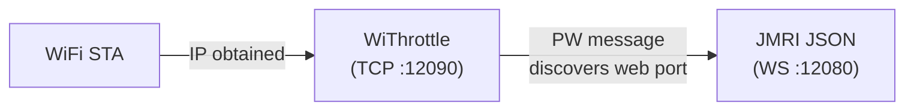
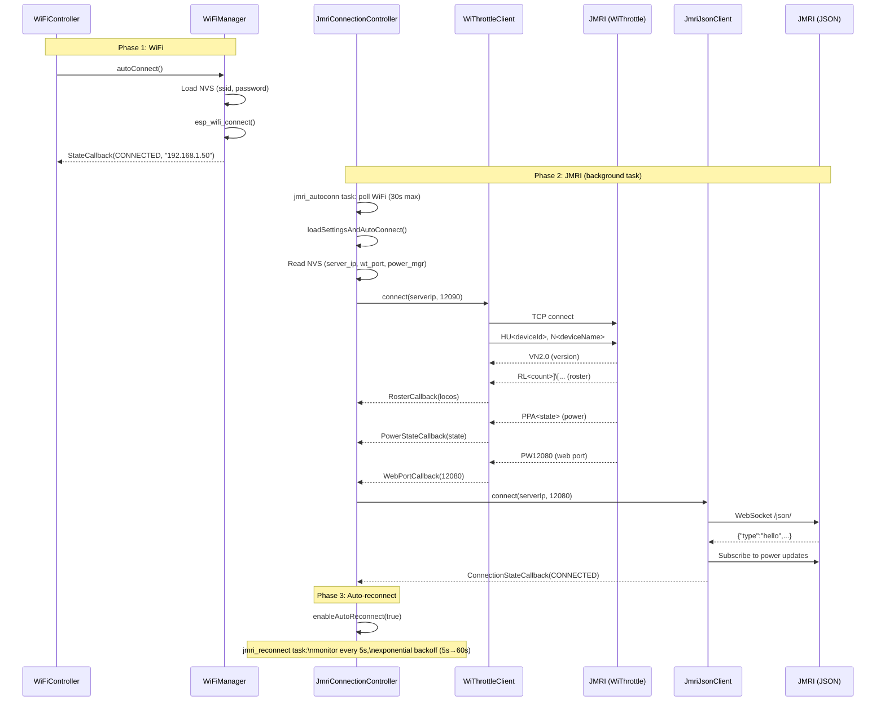
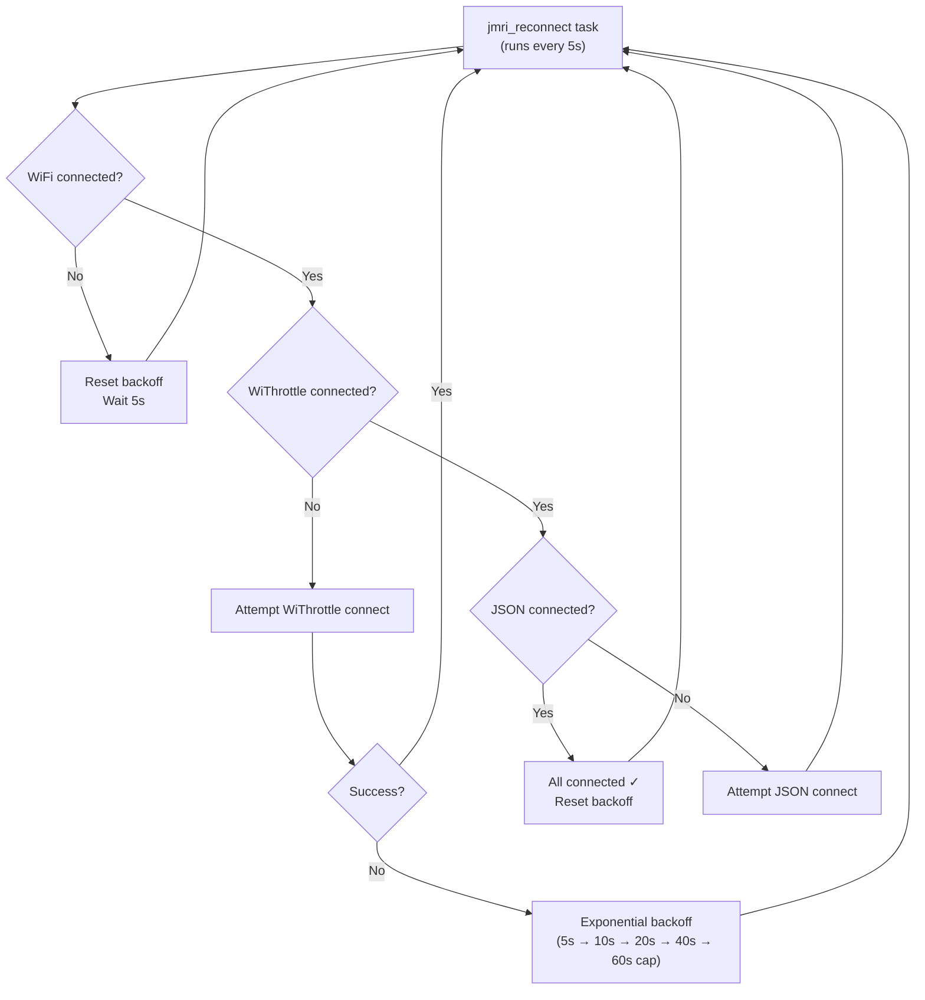

# Connection Flow

## Overview

Three connections are established: WiFi, WiThrottle (TCP), and JMRI JSON (WebSocket). They have a dependency chain — each requires the previous to be up.

---

## Full Connection Sequence

---

## Auto-Reconnect Behaviour

## WiFi Config Screen

If WiFi credentials are not stored (first boot) or the user navigates to settings, the `WiFiConfigScreen` provides:
- Network scanning
- SSID/password entry with on-screen keyboard
- Connect/disconnect/forget actions
- Credentials saved to NVS on successful connection
