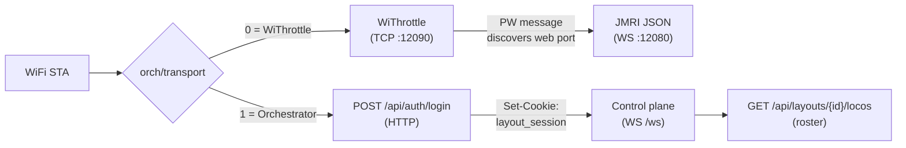
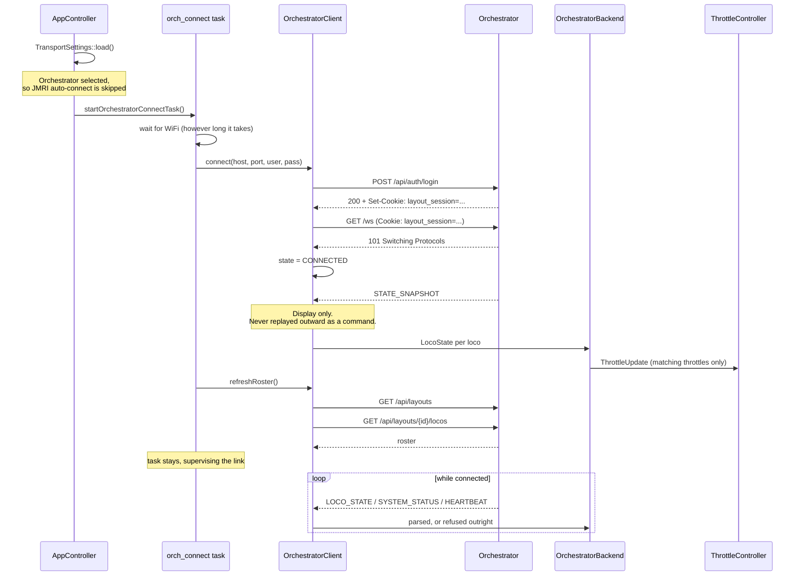
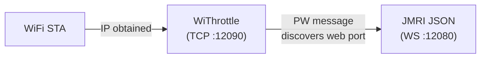
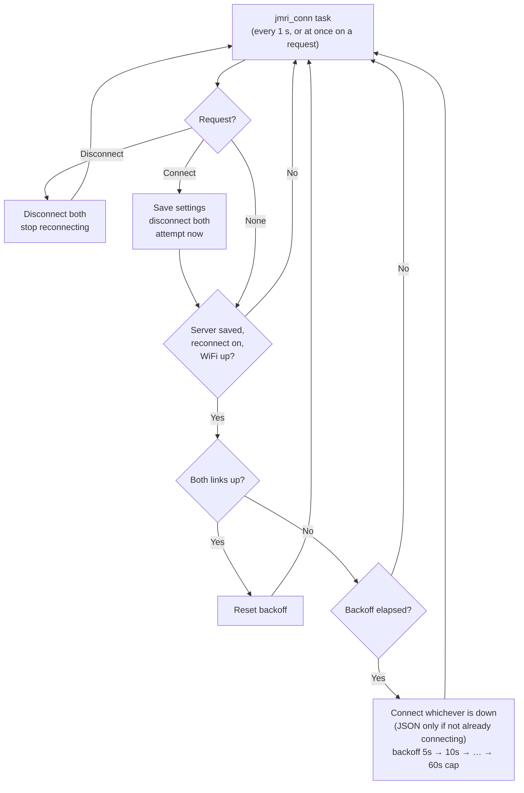

# Connection Flow

## Overview

WiFi comes up first, then **one** of two transports — whichever `TransportSettings` selects.
The other's stack is never started, so the device does not sit retrying a server the operator
did not choose.

```mermaid
flowchart LR
    A["WiFi STA"] --> D{"orch/transport"}
    D -->|"0 = WiThrottle"| B["WiThrottle\n(TCP :12090)"]
    B -->|"PW message\ndiscovers web port"| C["JMRI JSON\n(WS :12080)"]
    D -->|"1 = Orchestrator"| E["POST /api/auth/login\n(HTTP)"]
    E -->|"Set-Cookie:\nlayout_session"| F["Control plane\n(WS /ws)"]
    F --> G["GET /api/layouts/{id}/locos\n(roster)"]
```

---

## Orchestrator Connection Sequence

Two steps, because the orchestrator authenticates with a session cookie rather than a bearer
token — and the browser-oriented cookie is what the WebSocket upgrade carries.

```mermaid
sequenceDiagram
    participant AC as AppController
    participant OT as orch_connect task
    participant OC as OrchestratorClient
    participant ORCH as Orchestrator
    participant OB as OrchestratorBackend
    participant TC as ThrottleController

    AC->>AC: TransportSettings::load()
    Note over AC: Orchestrator selected,<br/>so JMRI auto-connect is skipped
    AC->>OT: startOrchestratorConnectTask()
    OT->>OT: wait for WiFi (however long it takes)

    OT->>OC: connect(host, port, user, pass)
    OC->>ORCH: POST /api/auth/login
    ORCH-->>OC: 200 + Set-Cookie: layout_session=...
    OC->>ORCH: GET /ws (Cookie: layout_session=...)
    ORCH-->>OC: 101 Switching Protocols
    OC->>OC: state = CONNECTED

    ORCH-->>OC: STATE_SNAPSHOT
    Note over OC: Display only.<br/>Never replayed outward as a command.
    OC->>OB: LocoState per loco
    OB->>TC: ThrottleUpdate (matching throttles only)

    OT->>OC: refreshRoster()
    OC->>ORCH: GET /api/layouts
    OC->>ORCH: GET /api/layouts/{id}/locos
    ORCH-->>OC: roster
    Note over OT: task stays, supervising the link

    loop while connected
        ORCH-->>OC: LOCO_STATE / SYSTEM_STATUS / HEARTBEAT
        OC->>OB: parsed, or refused outright
    end
```

### Orchestrator reconnection

`orch_connect` runs for the life of the application and is the only thing that calls
`OrchestratorClient::connect()` (F-24):

- It waits for WiFi however long that takes, then logs in.
- A failed login is retried with backoff — 5 s, doubling, capped at a minute, which keeps
  under the orchestrator's five-logins-a-minute limit.
- A dropped socket first gets 30 s of `esp_websocket_client`'s own reconnect, which reuses the
  session cookie. If it is still down after that, the supervisor logs in afresh.
- A roster read that fails after a good login is retried every 30 s.
- **Connect** on the orchestrator config screen saves the settings and wakes the supervisor,
  which logs in at once with them.

---

## WiThrottle Connection Sequence

The original path, unchanged. Used when `orch/transport` is `0` (the default).

```mermaid
flowchart LR
    A["WiFi STA"] -->|"IP obtained"| B["WiThrottle\n(TCP :12090)"]
    B -->|"PW message\ndiscovers web port"| C["JMRI JSON\n(WS :12080)"]
```

---

## Full Connection Sequence

```mermaid
sequenceDiagram
    participant WC as WiFiController
    participant WM as WiFiManager
    participant JCC as JmriConnectionController
    participant WT as WiThrottleClient
    participant JMRI_WT as JMRI (WiThrottle)
    participant JC as JmriJsonClient
    participant JMRI_JSON as JMRI (JSON)

    Note over WC,WM: Phase 1: WiFi

    WC->>WM: autoConnect()
    WM->>WM: Load NVS (ssid, password)
    WM->>WM: esp_wifi_connect()
    WM-->>WC: StateCallback(CONNECTED, "192.168.1.50")

    Note over JCC,JMRI_JSON: Phase 2: JMRI (background task)

    JCC->>JCC: start(): read NVS (server_ip, wt_port, json_port, power_mgr)
    JCC->>JCC: jmri_conn task: wait for WiFi (however long it takes)

    JCC->>WT: connect(serverIp, 12090)
    WT->>JMRI_WT: TCP connect
    WT->>JMRI_WT: HU<deviceId>, N<deviceName>
    JMRI_WT-->>WT: VN2.0 (version)
    JMRI_WT-->>WT: RL<count>]\[... (roster)
    WT-->>JCC: RosterCallback(locos)
    JMRI_WT-->>WT: PPA<state> (power)
    WT-->>JCC: PowerStateCallback(state)
    JMRI_WT-->>WT: PW12080 (web port)
    WT-->>JCC: WebPortCallback(12080)
    Note over JCC: recorded only; the jmri_conn task<br/>moves the JSON client if the port differs

    JCC->>JC: connect(serverIp, json_port)
    JC->>JMRI_JSON: WebSocket /json/
    JMRI_JSON-->>JC: {"type":"hello",...}
    JC->>JMRI_JSON: Subscribe to power updates
    JC-->>JCC: ConnectionStateCallback(CONNECTED)

    Note over JCC: Phase 3: Auto-reconnect

    Note over JCC: the same jmri_conn task keeps both links up:\nchecks every second, reconnects with backoff (5s→60s)
```

---

## Auto-Reconnect Behaviour

Every JMRI connect and disconnect — at boot, after an outage, and from the config screen — runs
on the one `jmri_conn` task (F-34). The screen only asks.

```mermaid
flowchart TD
    A["jmri_conn task\n(every 1 s, or at once on a request)"] --> R{"Request?"}
    R -->|Disconnect| S["Disconnect both\nstop reconnecting"]
    S --> A
    R -->|Connect| T["Save settings\ndisconnect both\nattempt now"]
    T --> B
    R -->|None| B{"Server saved,\nreconnect on,\nWiFi up?"}
    B -->|No| A
    B -->|Yes| D{"Both links up?"}
    D -->|Yes| E["Reset backoff"]
    E --> A
    D -->|No| F{"Backoff elapsed?"}
    F -->|No| A
    F -->|Yes| G["Connect whichever is down\n(JSON only if not already connecting)\nbackoff 5s → 10s → … → 60s cap"]
    G --> A
```

- **Disconnect sticks.** It turns reconnecting off until the next Connect or a reboot. The old
  reconnect task undid it within five seconds.
- **WiFi is waited for indefinitely.** The old auto-connect gave up after 30 s and never
  started reconnecting (F-24).
- **The JSON port** comes from WiThrottle's `PW` line. The receive task only records it; the
  worker saves it as `json_port` and moves the JSON client if it changed. Connecting the JSON
  client from the receive task raced the reconnect task (F-34).
- **Under the orchestrator** the task is never started, and Connect on the JMRI screen only
  saves the settings, on a one-shot `jmri_save` task.

## WiFi Config Screen

If WiFi credentials are not stored (first boot) or the user navigates to settings, the `WiFiConfigScreen` provides:
- Network scanning
- SSID/password entry with on-screen keyboard
- Connect/disconnect/forget actions
- Credentials saved to NVS on successful connection — only then, so a mistyped password does
  not replace a good one (F-40)
- After five immediate retries the connection shows as failed but keeps retrying in the
  background (5 s, doubling, capped at a minute) until the operator presses Disconnect or
  Forget, which both stay available while it does (F-24)
