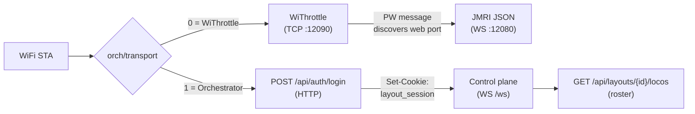
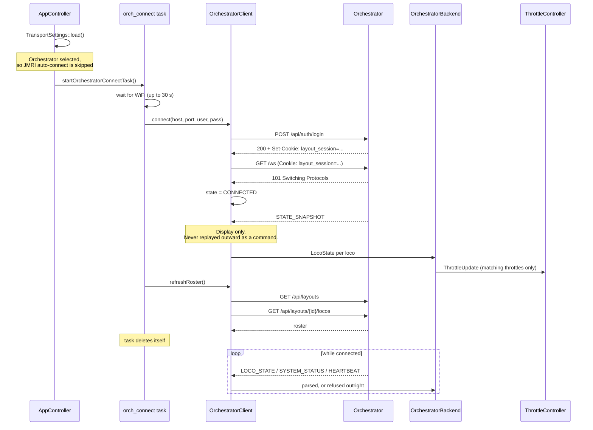
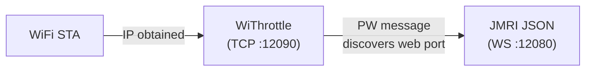
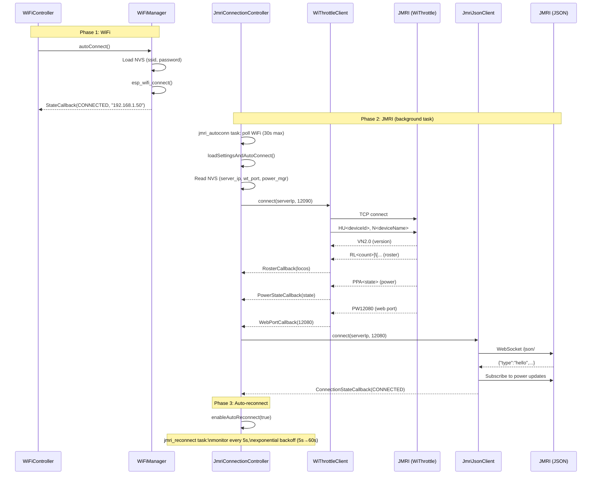
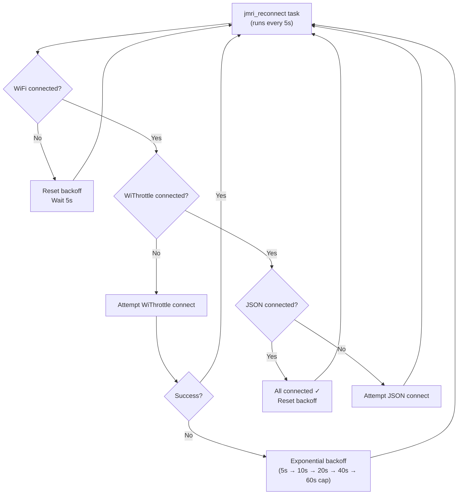

# Connection Flow

## Overview

WiFi comes up first, then **one** of two transports — whichever `TransportSettings` selects.
The other's stack is never started, so the device does not sit retrying a server the operator
did not choose.

```mermaid
flowchart LR
    A["WiFi STA"] --> D{"orch/transport"}
    D -->|"0 = WiThrottle"| B["WiThrottle\n(TCP :12090)"]
    B -->|"PW message\ndiscovers web port"| C["JMRI JSON\n(WS :12080)"]
    D -->|"1 = Orchestrator"| E["POST /api/auth/login\n(HTTP)"]
    E -->|"Set-Cookie:\nlayout_session"| F["Control plane\n(WS /ws)"]
    F --> G["GET /api/layouts/{id}/locos\n(roster)"]
```

---

## Orchestrator Connection Sequence

Two steps, because the orchestrator authenticates with a session cookie rather than a bearer
token — and the browser-oriented cookie is what the WebSocket upgrade carries.

```mermaid
sequenceDiagram
    participant AC as AppController
    participant OT as orch_connect task
    participant OC as OrchestratorClient
    participant ORCH as Orchestrator
    participant OB as OrchestratorBackend
    participant TC as ThrottleController

    AC->>AC: TransportSettings::load()
    Note over AC: Orchestrator selected,<br/>so JMRI auto-connect is skipped
    AC->>OT: startOrchestratorConnectTask()
    OT->>OT: wait for WiFi (up to 30 s)

    OT->>OC: connect(host, port, user, pass)
    OC->>ORCH: POST /api/auth/login
    ORCH-->>OC: 200 + Set-Cookie: layout_session=...
    OC->>ORCH: GET /ws (Cookie: layout_session=...)
    ORCH-->>OC: 101 Switching Protocols
    OC->>OC: state = CONNECTED

    ORCH-->>OC: STATE_SNAPSHOT
    Note over OC: Display only.<br/>Never replayed outward as a command.
    OC->>OB: LocoState per loco
    OB->>TC: ThrottleUpdate (matching throttles only)

    OT->>OC: refreshRoster()
    OC->>ORCH: GET /api/layouts
    OC->>ORCH: GET /api/layouts/{id}/locos
    ORCH-->>OC: roster
    Note over OT: task deletes itself

    loop while connected
        ORCH-->>OC: LOCO_STATE / SYSTEM_STATUS / HEARTBEAT
        OC->>OB: parsed, or refused outright
    end
```

---

## WiThrottle Connection Sequence

The original path, unchanged. Used when `orch/transport` is `0` (the default).

```mermaid
flowchart LR
    A["WiFi STA"] -->|"IP obtained"| B["WiThrottle\n(TCP :12090)"]
    B -->|"PW message\ndiscovers web port"| C["JMRI JSON\n(WS :12080)"]
```

---

## Full Connection Sequence

```mermaid
sequenceDiagram
    participant WC as WiFiController
    participant WM as WiFiManager
    participant JCC as JmriConnectionController
    participant WT as WiThrottleClient
    participant JMRI_WT as JMRI (WiThrottle)
    participant JC as JmriJsonClient
    participant JMRI_JSON as JMRI (JSON)

    Note over WC,WM: Phase 1: WiFi

    WC->>WM: autoConnect()
    WM->>WM: Load NVS (ssid, password)
    WM->>WM: esp_wifi_connect()
    WM-->>WC: StateCallback(CONNECTED, "192.168.1.50")

    Note over JCC,JMRI_JSON: Phase 2: JMRI (background task)

    JCC->>JCC: jmri_autoconn task: poll WiFi (30s max)
    JCC->>JCC: loadSettingsAndAutoConnect()
    JCC->>JCC: Read NVS (server_ip, wt_port, power_mgr)

    JCC->>WT: connect(serverIp, 12090)
    WT->>JMRI_WT: TCP connect
    WT->>JMRI_WT: HU<deviceId>, N<deviceName>
    JMRI_WT-->>WT: VN2.0 (version)
    JMRI_WT-->>WT: RL<count>]\[... (roster)
    WT-->>JCC: RosterCallback(locos)
    JMRI_WT-->>WT: PPA<state> (power)
    WT-->>JCC: PowerStateCallback(state)
    JMRI_WT-->>WT: PW12080 (web port)
    WT-->>JCC: WebPortCallback(12080)

    JCC->>JC: connect(serverIp, 12080)
    JC->>JMRI_JSON: WebSocket /json/
    JMRI_JSON-->>JC: {"type":"hello",...}
    JC->>JMRI_JSON: Subscribe to power updates
    JC-->>JCC: ConnectionStateCallback(CONNECTED)

    Note over JCC: Phase 3: Auto-reconnect

    JCC->>JCC: enableAutoReconnect(true)
    Note over JCC: jmri_reconnect task:\nmonitor every 5s,\nexponential backoff (5s→60s)
```

---

## Auto-Reconnect Behaviour

```mermaid
flowchart TD
    A["jmri_reconnect task\n(runs every 5s)"] --> B{"WiFi connected?"}
    B -->|No| C["Reset backoff\nWait 5s"]
    C --> A
    B -->|Yes| D{"WiThrottle connected?"}
    D -->|Yes| E{"JSON connected?"}
    D -->|No| F["Attempt WiThrottle connect"]
    F --> G{"Success?"}
    G -->|Yes| A
    G -->|No| H["Exponential backoff\n(5s → 10s → 20s → 40s → 60s cap)"]
    H --> A
    E -->|Yes| I["All connected ✓\nReset backoff"]
    I --> A
    E -->|No| J["Attempt JSON connect"]
    J --> A
```

## WiFi Config Screen

If WiFi credentials are not stored (first boot) or the user navigates to settings, the `WiFiConfigScreen` provides:
- Network scanning
- SSID/password entry with on-screen keyboard
- Connect/disconnect/forget actions
- Credentials saved to NVS on successful connection
