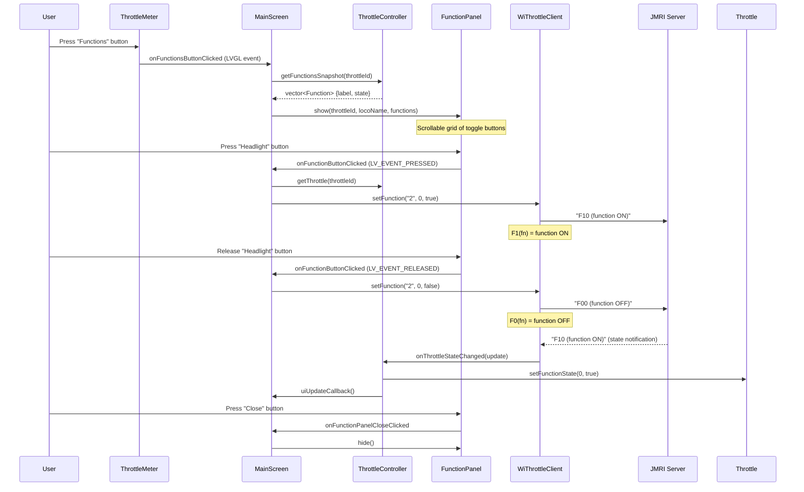
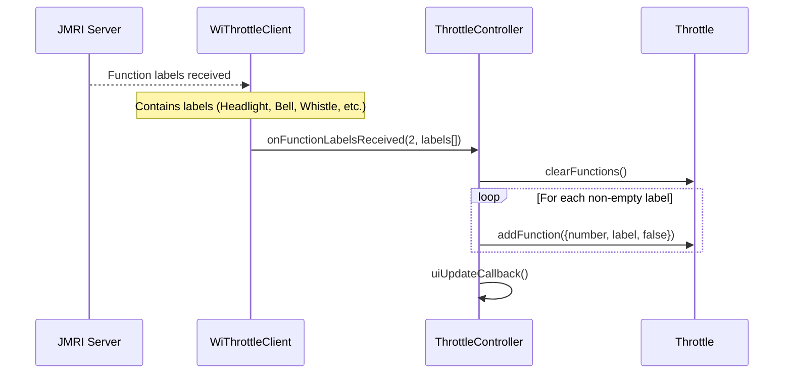

# Function Control Flow

## Overview

Each locomotive supports up to 29 functions (F0–F28) with labels from the JMRI roster. Functions are toggled via a scrollable overlay panel.

---

## Sequence

## Function Label Discovery

Function labels arrive from JMRI after locomotive acquisition:

## Notes

- **Momentary vs latching:** The current implementation sends function ON on press and OFF on release (momentary behaviour). Some functions (e.g. headlight) may need latching — this depends on the JMRI/decoder configuration.
- **Scroll guard:** `FunctionPanel::isScrolling()` prevents accidental button presses while scrolling through the function list.
- **Maximum functions:** 29 (F0–F28), matching DCC standard.
