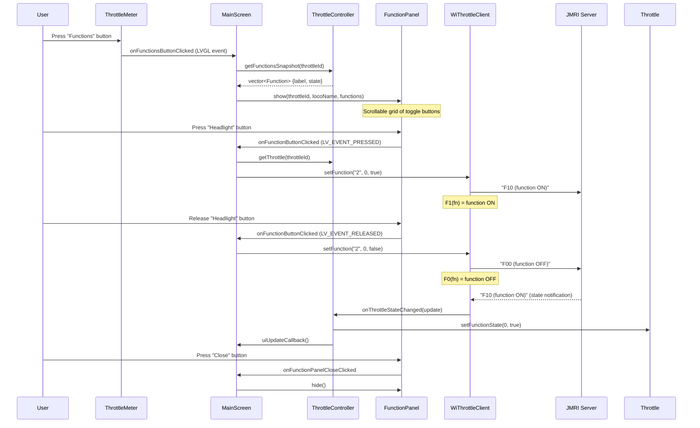
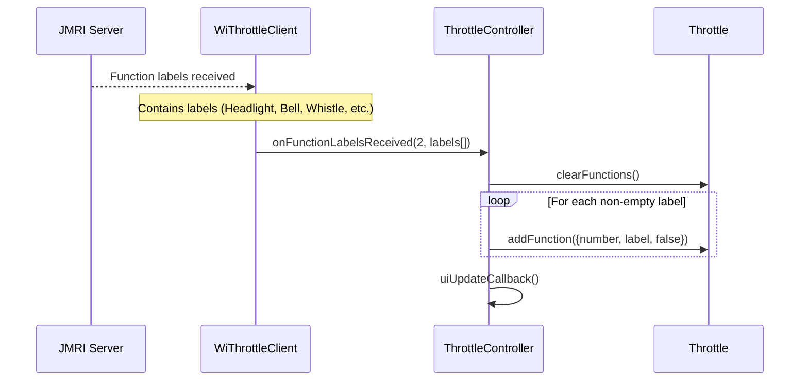

# Function Control Flow

## Overview

Each locomotive supports up to 29 functions (F0–F28) with labels from the JMRI roster. Functions are toggled via a scrollable overlay panel.

---

## Sequence

```mermaid
sequenceDiagram
    participant User
    participant TM as ThrottleMeter
    participant MS as MainScreen
    participant TC as ThrottleController
    participant FP as FunctionPanel
    participant WT as WiThrottleClient
    participant JMRI as JMRI Server
    participant T as Throttle

    User->>TM: Press "Functions" button
    TM->>MS: onFunctionsButtonClicked (LVGL event)
    MS->>TC: getFunctionsSnapshot(throttleId)
    TC-->>MS: vector<Function> {label, state}
    MS->>FP: show(throttleId, locoName, functions)
    Note over FP: Scrollable grid of toggle buttons

    User->>FP: Press "Headlight" button
    FP->>MS: onFunctionButtonClicked (LV_EVENT_PRESSED)
    MS->>TC: getThrottle(throttleId)
    MS->>WT: setFunction("2", 0, true)
    WT->>JMRI: "F10 (function ON)"
    Note over WT: F1(fn) = function ON

    User->>FP: Release "Headlight" button
    FP->>MS: onFunctionButtonClicked (LV_EVENT_RELEASED)
    MS->>WT: setFunction("2", 0, false)
    WT->>JMRI: "F00 (function OFF)"
    Note over WT: F0(fn) = function OFF

    JMRI-->>WT: "F10 (function ON)" (state notification)
    WT->>TC: onThrottleStateChanged(update)
    TC->>T: setFunctionState(0, true)
    TC->>MS: uiUpdateCallback()

    User->>FP: Press "Close" button
    FP->>MS: onFunctionPanelCloseClicked
    MS->>FP: hide()
```

## Function Label Discovery

Function labels arrive from JMRI after locomotive acquisition:

```mermaid
sequenceDiagram
    participant JMRI as JMRI Server
    participant WT as WiThrottleClient
    participant TC as ThrottleController
    participant T as Throttle

    JMRI-->>WT: Function labels received
    Note over WT: Contains labels (Headlight, Bell, Whistle, etc.)
    WT->>TC: onFunctionLabelsReceived(2, labels[])
    TC->>T: clearFunctions()
    loop For each non-empty label
        TC->>T: addFunction({number, label, false})
    end
    TC->>TC: uiUpdateCallback()
```

## Notes

- **Momentary vs latching depends on the transport** (F-28). The UI reports the *button*, via `ThrottleController::onFunctionButton(throttle, fn, pressed)`, and the controller asks the port's `functionCommandIsButtonEvent()`:
  - **WiThrottle** (true): ON at press, OFF at release. JMRI applies each function's own latching setting to that pair.
  - **Orchestrator** (false): `FUNCTION_COMMAND` stores the state it is sent, so press-on/release-off made every function momentary. A press sends the opposite of the known state; the release sends nothing. The display follows the `LOCO_STATE` the orchestrator publishes after it.
- **Scroll guard:** `FunctionPanel::isScrolling()` prevents accidental button presses while scrolling through the function list.
- **Maximum functions:** 29 (F0–F28), matching DCC standard.
