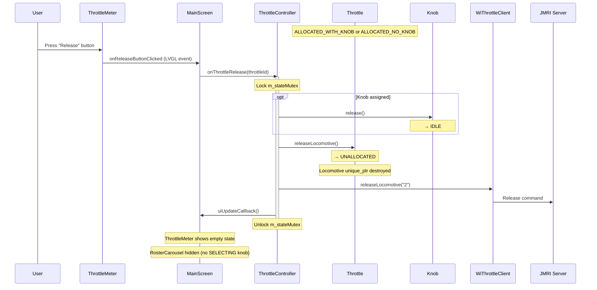

# Release Flow

## Overview

Releasing a locomotive disconnects it from the throttle, frees any assigned knob, and sends a release command to JMRI.

---

## Sequence

## Post-Release State

| Object | State after release |
|--------|-------------------|
| Throttle | `UNALLOCATED` — no loco, no knob |
| Knob (if was assigned) | `IDLE` — ready to assign to any throttle |
| Locomotive | Destroyed (unique_ptr released) |
| WiThrottle | Loco released in JMRI — other throttles can acquire it |
| UI | Throttle meter shows blank/idle, knob indicator deselected |
