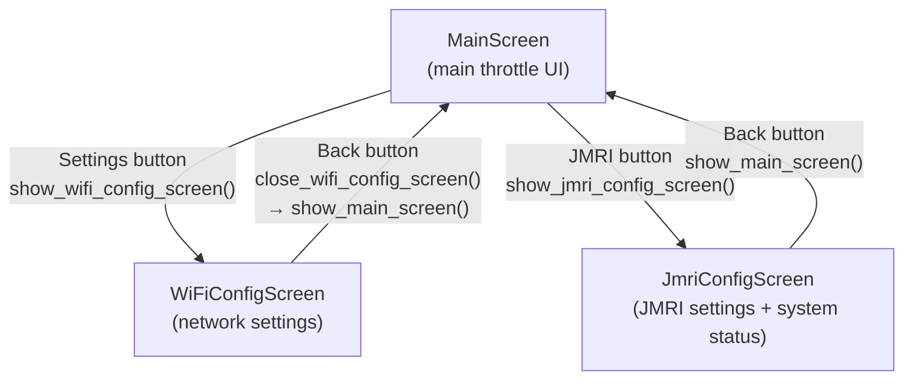
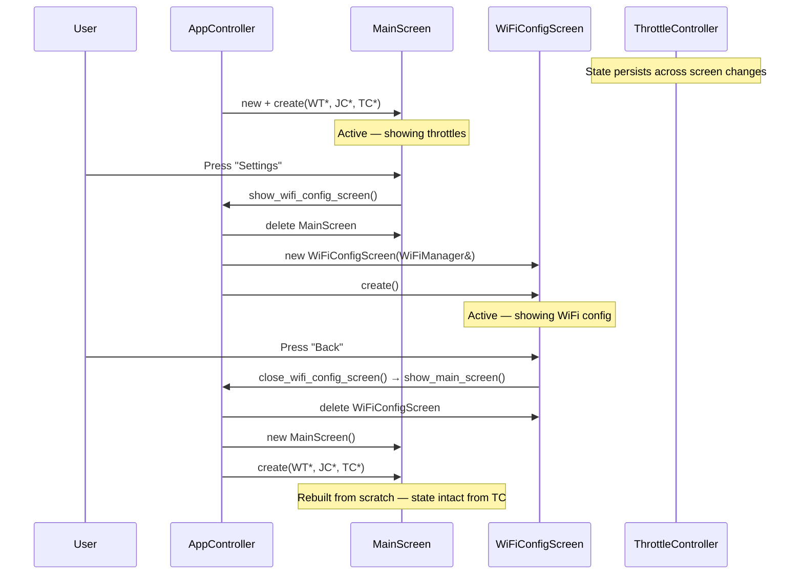

# Screen Navigation

## Overview

Three screens exist. Navigation is managed through `AppController` and C-linkage wrapper functions that bridge `main.c` (C) and the C++ screen classes.

---

## Navigation Map

## Screen Lifecycle

## Key Points

- **MainScreen is recreated** each time `showMainScreen()` is called. This is safe because all state lives in `ThrottleController`.
- **Config screens are heap-allocated** and deleted when navigating away.
- **Wrapper functions** (`show_main_screen()`, `show_wifi_config_screen()`, etc.) provide `extern "C"` linkage so `main.c` and inter-screen navigation work without C++ name mangling.
- **LVGL lock** must be held when creating/destroying screens (handled by the callers).

## Wrapper Function Reference

| Wrapper | Defined in | Calls |
|---------|-----------|-------|
| `init_app_controller()` | `main_screen_wrapper.cpp` | `AppController::instance().initialise()` |
| `show_main_screen()` | `main_screen_wrapper.cpp` | `AppController::instance().showMainScreen()` |
| `show_wifi_config_screen()` | `wifi_config_wrapper.cpp` | `AppController::instance().showWiFiConfigScreen()` |
| `close_wifi_config_screen()` | `wifi_config_wrapper.cpp` | Calls `show_main_screen()` |
| `show_jmri_config_screen()` | `jmri_config_wrapper.cpp` | `AppController::instance().showJmriConfigScreen()` |
