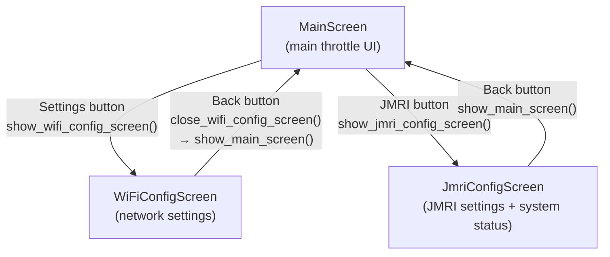
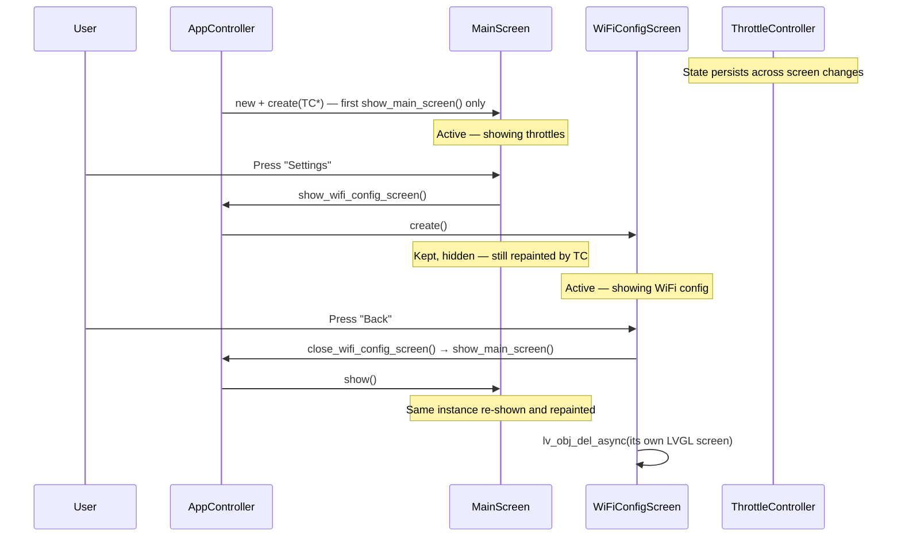

# Screen Navigation

## Overview

Three screens exist. Navigation is managed through `AppController` and C-linkage wrapper functions that bridge `main.c` (C) and the C++ screen classes.

---

## Navigation Map

```mermaid
flowchart TD
    MS["MainScreen\n(main throttle UI)"]
    WCS["WiFiConfigScreen\n(network settings)"]
    JCS["JmriConfigScreen\n(JMRI settings + system status)"]

    MS -->|"Settings button\nshow_wifi_config_screen()"| WCS
    MS -->|"JMRI button\nshow_jmri_config_screen()"| JCS
    WCS -->|"Back button\nclose_wifi_config_screen()\n→ show_main_screen()"| MS
    JCS -->|"Back button\nshow_main_screen()"| MS
```

## Screen Lifecycle

```mermaid
sequenceDiagram
    participant User
    participant AC as AppController
    participant MS as MainScreen
    participant WCS as WiFiConfigScreen
    participant TC as ThrottleController

    Note over TC: State persists across screen changes

    AC->>MS: new + create(TC*) — first show_main_screen() only
    Note over MS: Active — showing throttles

    User->>MS: Press "Settings"
    MS->>AC: show_wifi_config_screen()
    AC->>WCS: create()
    Note over MS: Kept, hidden — still repainted by TC
    Note over WCS: Active — showing WiFi config

    User->>WCS: Press "Back"
    WCS->>AC: close_wifi_config_screen() → show_main_screen()
    AC->>MS: show()
    Note over MS: Same instance re-shown and repainted
    WCS->>WCS: lv_obj_del_async(its own LVGL screen)
```

## Key Points

- **MainScreen is built once and re-shown**, never destroyed. Destroying it from a Back
  handler was a use-after-free: an encoder or network task that had already read the UI
  callback could be waiting on the LVGL lock to repaint it (F-21). And `lv_scr_load` frees
  nothing, so rebuilding it also leaked the whole tree on every return (F-32).
- **Config screens delete their own LVGL tree** (`lv_obj_del_async`) when left. Their C++
  objects are kept by `AppController`, except the settings screen, which is rebuilt on each
  open. None of them registers on a client's connection callback: they poll on an LVGL
  timer, because that slot belongs to the active backend.
- **Wrapper functions** (`show_main_screen()`, `show_wifi_config_screen()`, etc.) provide `extern "C"` linkage so `main.c` and inter-screen navigation work without C++ name mangling.
- **LVGL lock** must be held when creating/destroying screens (handled by the callers).

## Wrapper Function Reference

| Wrapper | Defined in | Calls |
|---------|-----------|-------|
| `init_app_controller()` | `main_screen_wrapper.cpp` | `AppController::instance().initialise()` |
| `show_main_screen()` | `main_screen_wrapper.cpp` | `AppController::instance().showMainScreen()` |
| `show_wifi_config_screen()` | `wifi_config_wrapper.cpp` | `AppController::instance().showWiFiConfigScreen()` |
| `close_wifi_config_screen()` | `wifi_config_wrapper.cpp` | Calls `show_main_screen()` |
| `show_jmri_config_screen()` | `jmri_config_wrapper.cpp` | `AppController::instance().showJmriConfigScreen()` |
