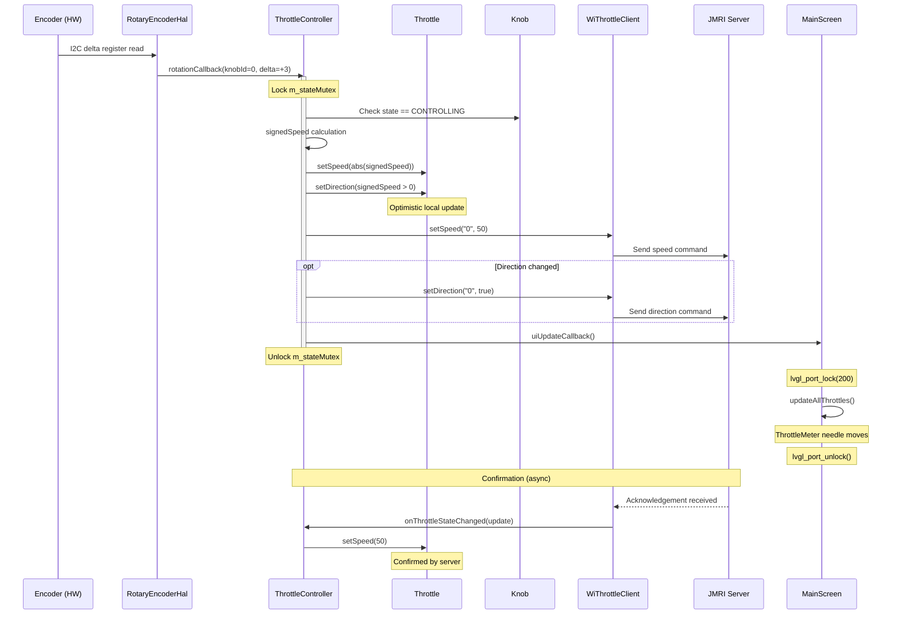
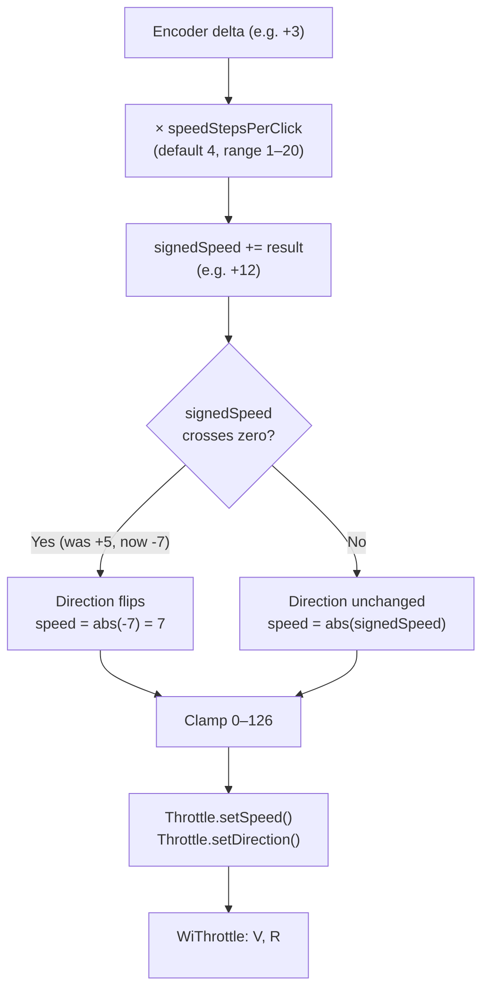
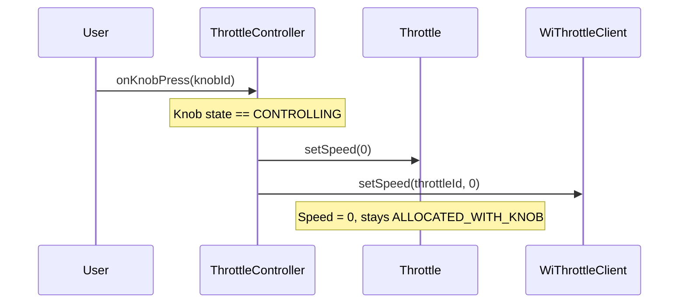
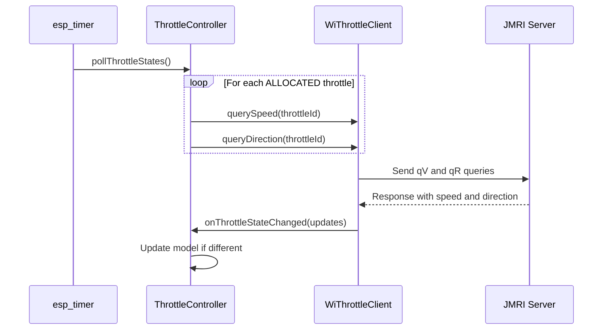

# Speed Control Flow

## Overview

When a knob is in `CONTROLLING` state, encoder rotation changes the locomotive's speed. The system uses **optimistic updates** — the local model is updated immediately for responsive UI, then the command is sent to JMRI. A periodic poll (every 10 s) reconciles any drift.

---

## Sequence

---

## Speed Model Detail

## Emergency Stop

Pressing the encoder button while `CONTROLLING` triggers an immediate stop:

---

## Periodic Polling (Resilience)

An `esp_timer` fires every 10 seconds and queries JMRI for the true speed/direction of all allocated throttles. This catches cases where another controller changed the loco's state, or where a command was lost.

