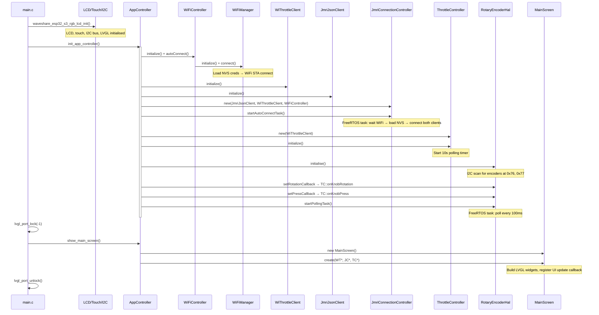

# Startup Flow

## Sequence

## Key Points

1. **Hardware first** — LCD, touch, and I2C bus are initialised before any application code runs.
2. **WiFi auto-connect** — attempts immediately using stored NVS credentials. Non-blocking.
3. **JMRI auto-connect** — runs in a background task that waits up to 30 s for WiFi before attempting.
4. **Encoder polling** — starts regardless of whether physical encoders are detected. Missing encoders are logged but don't block startup.
5. **UI last** — the main screen is created after all services are initialised, ensuring it can safely reference all controllers.
6. **Test mode** — when `CONFIG_THROTTLE_TESTS` is set in Kconfig, `app_main()` calls `run_throttle_tests()` instead of the above sequence.
