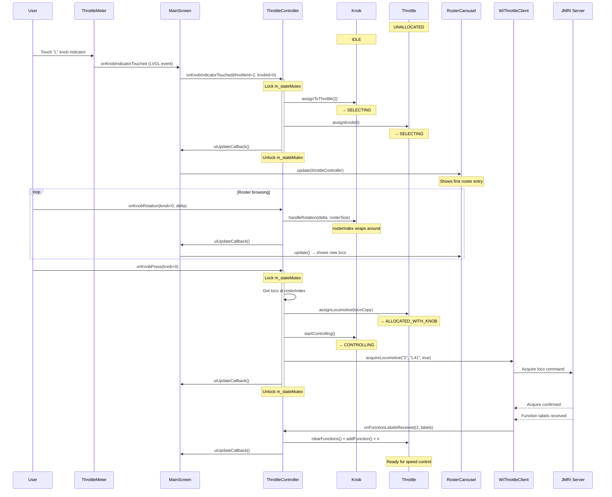
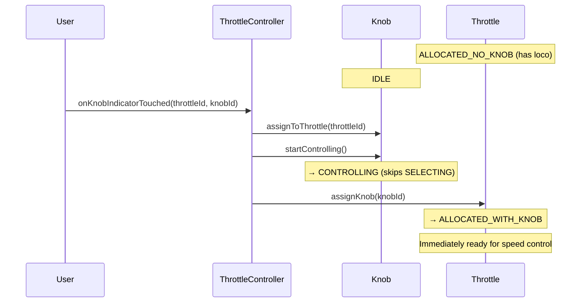
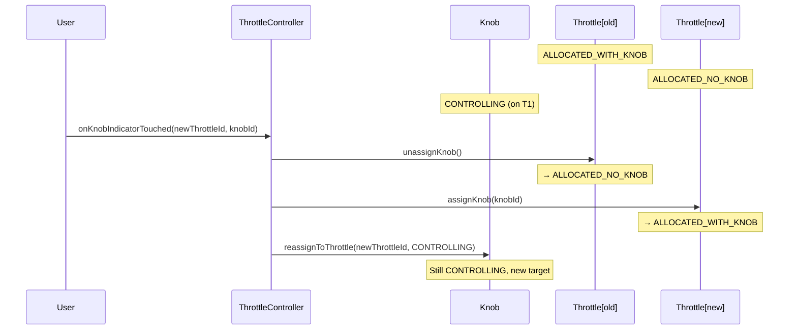

# Throttle Selection Flow

## Overview

A user assigns a physical knob to an unallocated throttle, browses the roster, and acquires a locomotive.

---

## Sequence

---

## Assigning a Knob to an Already-Allocated Throttle

When a throttle is in `ALLOCATED_NO_KNOB` (has a loco but no active knob), touching a knob indicator skips the roster phase:

---

## Moving a Knob Between Throttles

