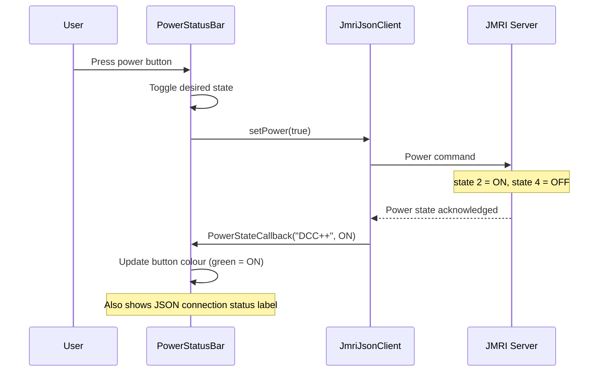

# Track Power Flow

## Overview

Track power is controlled via the JMRI JSON WebSocket API, not the WiThrottle protocol. This allows named power manager targeting (e.g. `"DCC++"`).

---

## Sequence

## Power States

| JMRI JSON Value | Meaning | UI Display |
|-----------------|---------|------------|
| `2` | ON | Green button |
| `4` | OFF | Red/grey button |
| `0` | UNKNOWN | Amber/warning |

## Connection Dependency

Track power control requires the JMRI JSON WebSocket connection to be active. The `PowerStatusBar` displays the connection status alongside the power button. If the WebSocket is disconnected, the power button is non-functional.

## Configured Power Manager

The power manager name (e.g. `"DCC++"`) is configurable via the JMRI settings screen and stored in NVS (`jmri`/`power_mgr`). This allows targeting a specific power district if the layout has multiple.
