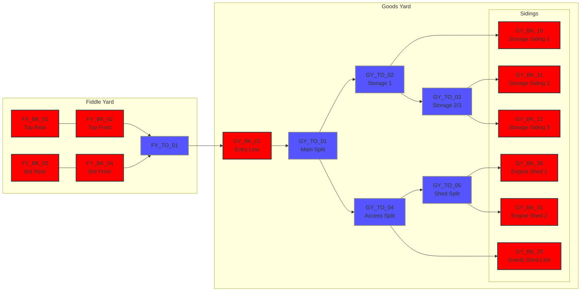

```mermaid
graph LR
    %% -- Naming Convention: LOC_TYPE_ID --
    %% LOC: FY (Fiddle Yard), GY (Goods Yard)
    %% TYPE: BK (Block), TO (Turnout)

    subgraph Fiddle_Yard[Fiddle Yard]
        direction LR
        %% Top Siding
        FY_BK_01[FY_BK_01<br/>Top Rear] --- FY_BK_02[FY_BK_02<br/>Top Front]
        %% Bottom Siding
        FY_BK_03[FY_BK_03<br/>Bot Rear] --- FY_BK_04[FY_BK_04<br/>Bot Front]
        
        %% Exit Turnout
        FY_BK_02 --> FY_TO_01[FY_TO_01]
        FY_BK_04 --> FY_TO_01
    end

    %% -- Entrance --
    FY_TO_01 --> GY_BK_01[GY_BK_01<br/>Entry Line]

    subgraph Scenic_Area[Goods Yard]
        direction LR
        
        %% Points
        GY_BK_01 --> GY_TO_01[GY_TO_01<br/>Main Split]
        GY_TO_01 --> GY_TO_02[GY_TO_02<br/>Storage 1]
        GY_TO_02 --> GY_TO_03[GY_TO_03<br/>Storage 2/3]
        GY_TO_01 --> GY_TO_04[GY_TO_04<br/>Access Split]
        GY_TO_04 --> GY_TO_05[GY_TO_05<br/>Shed Split]

        subgraph Sidings
            direction TB
            GY_BK_10[GY_BK_10<br/>Storage Siding 1]
            GY_BK_11[GY_BK_11<br/>Storage Siding 2]
            GY_BK_12[GY_BK_12<br/>Storage Siding 3]

            GY_BK_30[GY_BK_30<br/>Engine Shed 1]
            GY_BK_31[GY_BK_31<br/>Engine Shed 2]

            GY_BK_20[GY_BK_20<br/>Goods Shed Line]
        end

        %% Siding block connections
        GY_TO_02 --> GY_BK_10
        GY_TO_03 --> GY_BK_11
        GY_TO_03 --> GY_BK_12
        GY_TO_05 --> GY_BK_30
        GY_TO_05 --> GY_BK_31
        GY_TO_04 --> GY_BK_20
    end

    %% Styling
    classDef block fill:#f00,stroke:#333,stroke-width:2px;
    classDef turnout fill:#55f,stroke:#888,stroke-width:2px,shape:diamond;
    
    class FY_BK_01,FY_BK_02,FY_BK_03,FY_BK_04,GY_BK_01,GY_BK_10,GY_BK_11,GY_BK_12,GY_BK_20,GY_BK_30,GY_BK_31 block;
    class FY_TO_01,GY_TO_01,GY_TO_02,GY_TO_03,GY_TO_04,GY_TO_05 turnout;
```